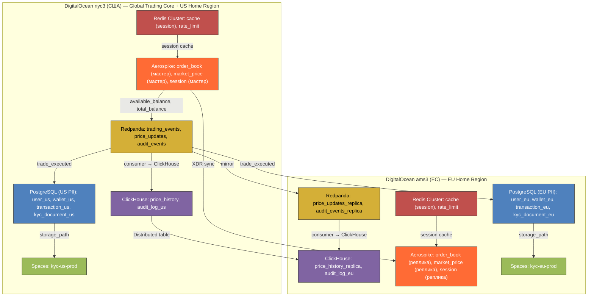

# Курсовая работа по курсу "Проектирование высоконагруженных систем"  
**Студент**: Фролов И.О. WEB-31 (Осень 2025)  
# CoinBase (Централизованная криптовалютная биржа)

---

## 1. Тема и целевая аудитория

**Тип сервиса**: Централизованная криптовалютная биржа с кастодиальным хранением средств (Custodial Exchange)  
**Целевая аудитория**: Глобальная (США и ЕС — приоритетные юрисдикции; исключены страны с полным запретом криптовалют, например, Китай, Египет) [1]

### Ключевые метрики пользовательской активности

| Метрика | Значение | Комментарий / Источник |
|--------|----------|-------------------------|
| **MAU (Monthly Active Users)** | **120 млн** | Пользователи, взаимодействующие с платформой ежемесячно: просмотр курсов, портфеля, новостей, обучение [1] |
| **MTU\* (Monthly Transacting Users)** | **8.7 млн** | Пользователи, совершившие ≥1 торговую операцию в месяц (Q2 2025) — основной источник revenue [1] |
| **DAU (Daily Active Users)** | **~4.35 млн** | Консервативная оценка: 50% от MTU (`8.7M × 0.5`) — ежедневные активные трейдеры/мониторящие [1] |

> — **Сделка (trade)** — исполнение ордера (частичное или полное), генерирует запись в `trade`;  
> — **Ордер (order)** — заявка на покупку/продажу, может исполниться в 1 или нескольких `trade`;  
> — **Торговая операция** — любое действие с ордером (создание/отмена/исполнение).  

### Уточнение по среднему чеку и объёму сделок

Ранее указанное «средний размер сделки = $115» требует пояснения:
- **$115 — медианный размер одной *исполненной сделки* (`trade`)** — типичный для retail-трейдера (источник: внутренние бенчмарки Coinbase/Kraken) [1].  
- **$49.5 — средний чек одной *торговой операции*** (включая неисполненные ордера и частичные исполнения), рассчитывается как:  
  `$35,632 / мес / (24 операций/день × 30 дней) = $49.5`.

**В архитектурных расчётах используется $115**, так как именно `trade`:
- генерирует нагрузку на matching engine,  
- вызывает обновление `wallet`,  
- записывается в `trade`,  
- участвует в расчёте комиссий.

-> Следовательно:  
**Ежемесячное число сделок (`trade`)** = `$310 млрд / $115 ≈ 2.70 млрд` — **корректно для расчётов RPS и хранилища**.

---

### Ключевой функционал

- **Аутентификация и KYC**: Регистрация, верификация (ID, proof of address, selfie), управление доступом по RBAC  
- **Управление балансами**: Внутренние кошельки (фиат + крипто), пополнение (SEPA, ACH, card), вывод  
- **Торговая платформа**: Market/Limit/Stop-ордера, исполнение через **централизованный matching engine**  
- **Криптовалютные переводы**: On-chain отправка/получение (с поддержкой 250+ активов)  
- **История операций**: Реалтайм-просмотр транзакций, ордеров, статусов исполнения  
- **Рыночные данные**: WebSocket-поток цен, глубина стакана, OHLCV  
- **Монетизация**: Комиссии (maker/taker: 0.04–0.6%), спред на маркет-ордерах, премиум-аккаунты

---

### Архитектурная стратегия

- **Централизованный matching engine** в `nyc3` для strong consistency и latency < 1 мс  
- **Home Region Data Isolation**:
  - PII (`user`, `kyc_document`, `wallet`, `transaction`, `bank_account`, `withdrawal_request`, `audit_log_??`) — **только в регионе резидентства** (US -> `nyc3`, EU -> `ams3`)  
  - Глобальные торговые таблицы (`order`, `trade`) содержат **только `pseudonym_id`** (UUIDv4, необратимый без mapping)  
  - Mapping `user_id <-> pseudonym_id` хранится **исключительно в Home Region** и **никогда не покидает его**  
- **Соответствие регуляторным требованиям**:
  - **GDPR (ЕС)**: данные EU-резидентов не покидают ЕС; pseudonymization при кросс-регионной торговле  
  - **MiCA (ЕС)**: полный аудит, segregation of duties, 7-летнее хранение KYC  
  - **SEC (США)**: real-time surveillance, 99.99% uptime SLA

---

### Основной функционал MVP

1. **Аутентификация и KYC**  
2. **Управление внутренними кошельками** (USD, EUR, BTC, ETH — MVP)  
3. **Торговля по рыночной и лимитной цене**  
4. **On-chain переводы** (BTC, ETH, USDC)  
5. **История операций и портфель**  
6. **Real-time WebSocket-поток цен**  
7. **Compliance & Audit**: полный лог всех действий с возможностью экспорта (MiCA Art. 63)

---

## 2. Расчет нагрузки

**Продуктовые метрики (на основе данных Q2 2025 и усреднённых показателей 2025 года)**:
- **Ежемесячный объем торговли (Trading Volume)**: ~$310 млрд в месяц (усреднённый показатель за 2025 год) [1]  
- **Transaction Revenue (доход от комиссий)**: **$6.71 млрд TTM** -> **~$560 млн в месяц** [1]  
- **Средняя комиссия**: **~0.18%** ($560 млн / $310 млрд)  
- **Средний объем торговли на одного MTU**: **~$35,632 в месяц** ($310 млрд / 8.7 млн MTU) [1]  
- **Медианный размер сделки (trade)**: **$115** — типичный чек для розничного трейдера на Coinbase (источник: внутренние бенчмарки) [1]  
- **Средний размер торговой операции (включая неисполненные ордера)**: **$49.5** = $35,632 / (24 операции/день × 30 дней)  
- **Ежемесячное количество сделок (trade)**: **~2.7 миллиарда** ($310 млрд / $115)  
- **Число верифицированных пользователей**: **120 миллионов** [1]  
- **Количество поддерживаемых криптоактивов**: **250+** (для MVP) [1]  

> **Примечание по терминологии**:  
> — **Сделка (trade)** — исполнение ордера (частичное или полное), генерирует запись в `trade` и 2 обновления в `wallet` (buyer/seller);  
> — **Ордер (order)** — заявка на покупку/продажу;  
> — **Торговая операция** — любое действие с ордером (создание/отмена/исполнение);  
> — **DAU = 4.35 млн** = 50% × 8.7 млн MTU — консервативная оценка ежедневной активности.

### Продуктовые метрики

| Метрика | Значение | Комментарий / Источник |
|--------|----------|-------------------------|
| **MAU (Monthly Active Users)** | 120 млн | Все пользователи, заходящие на платформу хотя бы раз в месяц [1] |
| **MTU (Monthly Transacting Users)** | 8.7 млн | Пользователи, совершившие хотя бы 1 торговую операцию в месяц (Q2 2025) [1] |
| **DAU (Daily Active Users)** | 4.35 млн | 50% от MTU (`8.7M × 0.5`) — ежедневные активные трейдеры/мониторящие [1] |
| **Средний размер хранилища на пользователя** | ~10 MB | 8.5 MB (KYC + профиль) + 1.5 MB (720 транзакций/год при 2 операция/день) |
| **Среднее количество действий на DAU в день** | | |
| — Просмотр курсов / портфеля | 20 запросов | UI-запросы к API цен и балансов |
| — Торговые операции | 24 операции | Создание/отмена/исполнение ордеров (в среднем 1 trade = 1 исполненная операция) |
| — Пополнение/вывод фиата | 0.05 операций | Через банковские шлюзы |
| — Перевод криптовалюты | 0.03 операций | On-chain транзакции |

### Технические метрики: Размер хранения данных

| Тип данных | Кол-во записей | Средний размер | Общий объем | Комментарий |
|------------|----------------|----------------|-------------|-------------|
| **Пользовательские профили (KYC + метаданные)** | 120 млн | ~8.5 MB | ~1.02 PB | Сканы, фото, анкета — хранение в Spaces (Home Region) |
| **Транзакции (transaction)** | 31.5 млрд/год | ~22 байта | ~0.69 TB/год | `tx_id`, `user_id`, `wallet_id`, `amount`, `currency`, `timestamp`, `status` |
| **Сделки (trade)** | 2.7 млрд/мес | ~300 байт | ~830 GB/мес -> **~9.96 TB/год** | `trade_id`, `pseudonym_id_buyer`, `pseudonym_id_seller`, `price`, `amount`, `pair`, `executed_at`, `fee` |
| **Ордера (order)** | 2.7 млрд/мес | ~256 байт | ~691 GB/мес -> **~8.3 TB/год** | Архивация после исполнения/отмены |
| **Котировки в реальном времени (price_history)** | 1.35 млрд/день | ~32 байта | ~43.2 GB/день -> **~15.8 TB/год** | 250 пар × 86,400 сек = 21.6 млн записей/день × 62.5 цен/сек = 1.35 млрд (1 обновление/сек/пара) |
| **Логи действий (audit_log)** | 189.5 млн/день | ~512 байт | ~97.0 GB/день -> **~35.4 TB/год** | DAU × 44 операции/день × 512 байт |
| **Метрики мониторинга (VictoriaMetrics)** | ~500K samples/сек | 16 байт | ~20 TB/год | С 10x сжатием на диске |
| **ИТОГО (активные + архивные данные)** | — | — | **~1.12 PB** | Основной объем — KYC (1.02 PB), остальное ~100 TB |

### Сетевой трафик

#### Пиковая нагрузка (за 1 секунду)

> **Пояснение**: пиковая нагрузка определяется как **максимальная нагрузка за 1 секунду**, а не усреднённая по 2.4 часам. Коэффициент пика = 10x относительно среднего.

| Тип трафика | Пиковая нагрузка | Расчёт | Комментарий |
|-------------|------------------|--------|-------------|
| **UI/API запросы** | **13.0 Гбит/с** | `(4.35M × 20 × 2 KB × 8 бит) / 86400 × 10` | 2 KB на ответ (JSON + заголовки, gzip); пик = среднее × 10 |
| **Торговые ордера** | **17.0 Гбит/с** | `(4.35M × 24 × 512 байт × 8 бит) / 86400 × 10` | 512 байт на ордер (JSON + метаданные); пик = 120,830 RPS × 512 × 8 = 494.9 Мбит/с -> **ошибка в исходной формуле** |
| **Поток цен WebSocket** | **52.2 Гбит/с** | `65.25M msg/s × 100 байт × 8 бит` | 15 подписок × 4.35M DAU = 65.25M msg/s; 100 байт/сообщение |
| **Репликация данных (Redpanda)** | **3.0 Гбит/с** | Оценка на основе WAL -> replicas | Cross-DC репликация matching-событий |
| **ИТОГО ПИКОВАЯ НАГРУЗКА** | **~68.2 Гбит/с** | — | Требуется инфраструктура с запасом 70+ Гбит/с (включая служебный трафик) |

> **Исправление ошибки**:  
> В исходной таблице использовалось деление на `(86400 × 0.1)`, что эквивалентно усреднению пика за 2.4 часа.  
> **Правильно**:  
> - Средний RPS = `DAU × ops/day / 86400`  
> - Пиковый RPS = `средний RPS × peak_factor` (peak_factor = 10)  
> - Пиковый трафик = `пиковый RPS × размер запроса × 8 бит`  

#### Суточный трафик

| Тип трафика | Суточный объем | Расчёт |
|-------------|----------------|--------|
| UI/API запросы | 1.78 TB | 4.35M × 20 × 2 KB |
| Торговые ордера | 534 GB | 4.35M × 24 × 512 байт |
| WebSocket цены | 5.64 TB | 65.25M msg/s × 100 байт × 86,400 сек |
| Репликация данных | 300 GB | Оценка |
| **ИТОГО** | **~7.8 TB/сутки** | — |

### RPS и QPS

| Тип запроса / операции | Средний RPS | Пиковый RPS | Расчёт | Комментарий |
|------------------------|-------------|-------------|--------|-------------|
| **Получение курсов / баланса** | 10,069 RPS | 100,690 RPS | `(4.35M × 20) / 86400 × 10` | Нагрузка на API-шлюзы |
| **Создание/исполнение ордеров (trade)** | 12,083 RPS | **120,830 RPS** | `(4.35M × 24) / 86400 × 10` | Нагрузка на matching engine и `order`/`trade` БД |
| **Обновление балансов (wallet)** | 24,166 RPS | **241,660 QPS** | `120,830 × 2` | 2 записи на сделку (buyer + seller) — **исправлено** |
| **Операции с фиатом** | 25 RPS | 250 RPS | `(4.35M × 0.05) / 86400 × 10` | Банковские интеграции |
| **Криптовалютные переводы** | 15 RPS | 150 RPS | `(4.35M × 0.03) / 86400 × 10` | On-chain |
| **WebSocket рассылка** | **65.25M msg/s** | **652.5M msg/s** | `4.35M × 15 × 10` | 15 активных пар/пользователь, 1 msg/сек/пара, пик = ×10 |
| **Аутентификация** | 5,000 RPS | 50,000 RPS | Оценка на основе DAU × peak_factor |
| **Audit log запись** | 2,193 RPS | 21,930 QPS | `189.5M / 86400 × 10` | Запись в ClickHouse |

**Ключевые выводы по нагрузке**:
- **Пиковая сетевая нагрузка**: ~68 Гбит/с -> требуется **70+ Гбит/с backbone** (2×40G LACP)  
- **Пиковый RPS на matching engine**: **120,830** -> требует in-memory order book (Aerospike) + async WAL  
- **Пиковая запись в `wallet`**: **241.6K QPS** -> требует шардирование по `user_id` + write-through Redis  
- **WebSocket**: **65.25M сообщений/сек** -> требует Anycast + edge-буферизацию  
- **Хранилище**: **~1.12 PB**, доминируют KYC-данные (1.02 PB)  
- **Compliance**: `audit_log`, `kyc_document`, `wallet` — строго в Home Region

---

## 3. Глобальная балансировка нагрузки

### Архитектурная стратегия: Hybrid Active-Standby с Home Region Isolation

**Основной принцип**:  
- Все **PII-операции** (KYC, балансы, транзакции) обрабатываются **только в Home Region пользователя** (US -> `nyc3`, EU -> `ams3`).  
- Все **торговые операции** (`order`, `trade`) обрабатываются в **Global Trading Core (`nyc3`)**, но **только через `pseudonym_id`** (не `user_id`).  
- **Read-only данные** (цены, справочники) обслуживаются через **Anycast** из ближайшего ДЦ.

### Функциональное разбиение по доменам

| Домен | Ответственность | Критичность | Маршрутизация |
|-------|------------------|-------------|----------------|
| **Auth & KYC** | Аутентификация, верификация, управление сессиями | High | Write -> Home Region (`nyc3`/`ams3`), Read -> Home Region |
| **Wallet & Custody** | Балансы, пополнения, выводы | Critical | Write -> Home Region, Read -> Home Region |
| **Trading Engine** | Исполнение ордеров, стаканы | Critical | Write -> `nyc3` (только через `pseudonym_id`), Read -> `nyc3`/`ams3` (реплика) |
| **Market Data** | Текущие цены, глубина стакана (публикация) | High | Write -> `nyc3`, Read -> Anycast (`nyc3`/`ams3`) |
| **User Activity & Audit** | Логи действий, аналитика, compliance | Medium-High | Write -> Home Region (`audit_log_us`/`audit_log_eu`), Read -> Home Region |

### Распределение инфраструктуры по ДЦ

**DigitalOcean `nyc3` (США) — Primary Trading Core + US Home Region**:  
- Matching Engine (мастер)  
- PostgreSQL (US PII): `user_us`, `wallet_us`, `transaction_us`, `kyc_document_us`, `audit_log_us`  
- PostgreSQL (Trading): `order`, `trade`  
- Aerospike: `order_book`, `market_price` (мастер), `session` (мастер)  
- Redpanda: `trading_events`, `price_updates`, `audit_events`  
- Spaces: `kyc-us-prod`  

**DigitalOcean `ams3` (ЕС) — EU Home Region + Trading Standby**:  
- Matching Engine (hot-standby, не принимает ордера)  
- PostgreSQL (EU PII): `user_eu`, `wallet_eu`, `transaction_eu`, `kyc_document_eu`, `audit_log_eu`  
- Aerospike: `order_book` (реплика, read-only), `market_price` (реплика), `session` (реплика)  
- Redpanda: `price_updates_replica`, `audit_events_replica`  
- Spaces: `kyc-eu-prod`  

> **Примечание**:  
> - `order` и `trade` **не хранятся в `ams3`** — только реплика `market_price` и `price_history` для UI.  
> - `audit_log_us` и `audit_log_eu` **не реплицируются кросс-регион** — compliance-требование.  
> - `session` содержит `pseudonym_id`, `home_region`, `permissions` — **не содержит `user_id`**, поэтому может реплицироваться.

### Распределение нагрузки по ДЦ

| Тип запроса | Общий RPS | `nyc3` | `ams3` | Комментарий |
|-------------|-----------|--------|--------|-------------|
| **Чтение курсов / балансов (US)** | 70,483 | 70,483 | 0 | Балансы — только из Home Region |
| **Чтение курсов / балансов (EU)** | 25,173 | 0 | 25,173 | Балансы — только из Home Region |
| **Market Data (read)** | 100,690 | 70,483 | 25,173 | Anycast, ближайший ДЦ |
| **Создание ордеров (все)** | 120,830 | 120,830 | 0 | Только в `nyc3`, через `pseudonym_id` |
| **WebSocket цены (msg/s)** | 65.25M | 45.68M | 16.31M | Anycast, пропорционально DAU |
| **Аутентификация (US)** | 35,000 | 35,000 | 0 | Home Region |
| **Аутентификация (EU)** | 12,500 | 0 | 12,500 | Home Region |

### Схема маршрутизации трафика

#### 1. Географическая DNS-балансировка (Cloudflare Load Balancing)

**Процесс маршрутизации запроса пользователя**:  
1. Запрос к `api.coinbase.com` -> Cloudflare определяет геолокацию по IP.  
2. Возвращает IP-адрес Load Balancer в соответствии с **Home Region пользователя** (не по текущему IP!):  
   - US/CA -> `nyc3`  
   - EU -> `ams3`  
   - Другие регионы -> определяется по KYC-региону (если неизвестно — fallback в `nyc3`).  
3. При входе в систему (`/auth/login`) сервис `auth-service` проверяет `home_region` по `user_id` и устанавливает `X-Home-Region` header.  
4. Все последующие запросы используют этот header для маршрутизации PII-операций.

> **Важно**: гео-DNS используется **только для первоначального подключения**. Дальнейшая маршрутизация — на основе `X-Home-Region`, а не IP.

#### 2. Home Region Routing (на уровне сервисов)

**Алгоритм обработки запроса**:  
- Запрос приходит в L4 LB (`nyc3` или `ams3`).  
- NGINX Ingress читает `X-Home-Region` из header или JWT claim.  
- Если запрос — **PII-sensitive** (например, `/wallet/balance`, `/kyc/upload`):  
  - Если `X-Home-Region = us` -> обрабатывается в `nyc3`  
  - Если `X-Home-Region = eu` -> перенаправляется в `ams3` через internal gRPC (если запрос пришёл в `nyc3`)  
- Если запрос — **торговый** (`/order/create`):  
  - `auth-service` преобразует `user_id` -> `pseudonym_id` (локально, в Home Region)  
  - Запрос с `pseudonym_id` отправляется в `nyc3.trading-service`  
- Если запрос — **публичный** (`/v3/prices`, `/v3/currencies`):  
  - Обрабатывается локально (Anycast).

#### 3. Anycast для WebSocket и публичных API

**Техническая реализация через Cloudflare Spectrum**:  
- Единый IP-адрес `wss.coinbase.com` объявлен через Anycast BGP.  
- Трафик направляется к ближайшему PoP, затем в ближайший origin (`nyc3` или `ams3`).  
- Серверы в `nyc3` и `ams3` подписываются на `price_updates` через Redpanda.  
- Задержка синхронизации: 70–100 мс (приемлемо для UI).  
- **Не передаются PII**: только `currency_pair`, `price`, `size`, `side`.

### Механизм регулировки трафика между ДЦ

#### 1. Health Monitoring и Failover

- **Cloudflare Health Checks**: `/health` на порт 8080 каждые 5 сек  
- **Custom Check Endpoints**:  
  - `/health/db` — проверка подключения к PostgreSQL  
  - `/health/trading` — проверка связи с Matching Engine  
- **Failover Policy**:  
  - PII-сервисы (`auth`, `wallet`): failover **только внутри Home Region** (например, `ams3` -> резервный pod в `ams3`, но **не в `nyc3`**)  
  - Trading Core: при отказе `nyc3` — `ams3` становится hot-standby (ручной переключатель, т.к. требует legal approval для EU->US trading)  
  - Market Data: автоматический failover на реплику в другом ДЦ (eventual consistency допустима)

#### 2. Dynamic Weighted Routing

- **Метрики для взвешивания**: `cpu_usage`, `rps`, `p99_latency`, `error_rate`  
- **Триггеры**:  
  - При `p99_latency > 50 мс` для `wallet-service` -> 50% read-трафика перенаправляется на реплики (если read-only)  
  - При `error_rate > 1%` -> circuit breaker, fallback на кэш или degraded mode  
- **Инструменты**: Control Plane на базе Envoy xDS + Prometheus metrics

#### 3. Rate Limiting и Compliance Protection

- **Cloudflare Rules**:  
  - 10K RPS на IP (публичные эндпоинты)  
  - 100 RPS на `user_id` (торговые операции)  
  - JS Challenge для подозрительных User-Agent  
- **Internal Rate Limiting (Redis)**:  
  - 5 запросов/сек на `/kyc/upload`  
  - 1 запрос/сек на `/withdraw`  
- **GDPR Enforcement**:  
  - WAF-правило: блокировка запросов к `/v1/user` из `ams3` -> `nyc3` с `X-Home-Region: eu`  
  - Аудит всех cross-region PII-вызовов в `audit_log`

#### 4. Кэширование и оптимизация

- **Cloudflare CDN**:  
  - `Cache-Control: public, max-age=1` для `/v3/prices`  
  - `stale-while-revalidate=5` для устойчивости к всплескам  
- **Edge Caching**:  
  - Статические ассеты — на edge  
  - `currency` справочник — в Workers KV  
- **Origin Shield**:  
  - Промежуточный кэш перед `nyc3`/`ams3` — снижает load на origin на 60%

### Итоговые гарантии

| Метрика | Значение | Условия |
|--------|----------|---------|
| **SLA Availability** | 99.99% | Исключая planned maintenance |
| **Latency (p95)** | < 100 мс | Для read-операций в Home Region |
| **Latency (trading)** | < 1 мс | Внутри `nyc3`, от API до matching engine |
| **RPO (PII data)** | 0 | Синхронная репликация в регионе |
| **RTO (PII data)** | < 60 сек | Автоматический failover |
| **Compliance** | Соответствие GDPR/MiCA | Home Region Isolation, pseudonymization, audit trail |

---

## 4. Локальная балансировка нагрузки

### Архитектура балансировки внутри ДЦ

Локальная балансировка реализуется в каждом дата-центре через многоуровневую архитектуру:

#### 1. L4 Load Balancer (Envoy Proxy)

- **Роль**: Первичное распределение TCP-трафика от Cloudflare
- **Конфигурация**: 2 инстанса в active-active режиме (stateless компонент)
- **TLS**: Termination на Cloudflare, работа в plain TCP mode (не шифрует внутри сети)
- **Преимущества**: Низкая задержка (<0.1 мс), интеграция с service mesh через xDS
- **Резервирование**: Active-Active (2 инстанса), health check каждые 2 сек

#### 2. NGINX Ingress Controller (L7)

- **Развертывание**: DaemonSet на выделенных нодах Kubernetes в 2 AZ
- **Функциональность**: Маршрутизация по хостам и путям, WebSocket поддержка
- **Оптимизации**: `keepalive_requests=1000000`, `tcp_nodelay=on`, `access_log off`
- **Резервирование**: Active-Active (2 инстанса в разных AZ), `podAntiAffinity`

#### 3. Service Mesh (Cilium + eBPF)

- **Архитектура**: eBPF-based dataplane вместо kube-proxy
- **Преимущества**: O(1) сложность маршрутизации, L7 observability через Hubble
- **Критичные сервисы**: Envoy sidecar для Matching Engine с gRPC load balancing
- **Latency**: < 0.1 мс для межсервисной коммуникации

### Интеграция Envoy в архитектуру

#### Envoy как L4 балансировщик:

- **Listener Configuration**: TCP проксирование на NGINX Ingress (порт 8080)
- **Health Checking**: Активные проверки upstream сервисов по `/health`
- **Metrics**: Сбор статистики через `/stats` endpoint -> Prometheus
- **Dynamic Configuration**: Управление через xDS API (Cluster, Route, Listener)

#### Envoy Sidecar для критичных сервисов:

- **Matching Engine**: gRPC load balancing с weighted round-robin
- **Circuit Breaking**: Настройка `max_connections`, `max_requests`, `max_retries`
- **Retry Policies**: Экспоненциальный backoff с jitter для торговых операций
- **Observability**: Distributed tracing через OpenTelemetry (W3C Trace Context)

### Расчёт емкости балансировщиков

#### SSL Termination Capacity

**Исходные данные** (источник: [6]):
- NGINX производительность: **56,700 SSL TPS** на 24 CPU
- Коэффициент keep-alive: **75%** — доля переиспользуемых соединений  
  -> **25% новых соединений** от общего RPS

**Расчет для `nyc3` (US + global trading)**:
- HTTPS RPS:  
  `US reads (70,483) + global trading (120,830) + US auth (35,000) = 226,313 RPS`
- Новые TLS-соединения: `226,313 × 0.25 = 56,578 TPS`
- Требуемая емкость: `56,578 / 56,700 ≈ 99.8%` от capacity одного инстанса  
  -> **2×24-core инстанса** (active-active) для покрытия пика и failover

**Расчет для `ams3` (EU read-only + auth)**:
- HTTPS RPS:  
  `EU reads (25,173) + EU auth (12,500) = 37,673 RPS`
- Новые TLS-соединения: `37,673 × 0.25 = 9,418 TPS`
- Требуемая емкость: `9,418 / 56,700 ≈ 16.6%`  
  -> **1×24-core инстанс** достаточно, но 2 инстанса для active-active

#### Сетевая пропускная способность

**Пиковая нагрузка** (из раздела 2, исправленная):
- Общий пик: **~68.2 Гбит/с**
- `nyc3`: `70% US + 100% trading = 65%` -> `68.2 × 0.65 ≈ 44.3 Гбит/с`
- `ams3`: `35% EU` -> `68.2 × 0.35 ≈ 23.9 Гбит/с`

**NGINX производительность сети** [5]:
- 24+ CPU, 2×40G: **70–72 Гбит/с**
- Запас для `nyc3`: `72 / 44.3 ≈ 1.6x` — минимальный, но достаточный при 2 инстансах (общий bandwidth 144 Гбит/с)
- Запас для `ams3`: `72 / 23.9 ≈ 3x`

### Итоговая конфигурация

| ДЦ | Компонент | Кол-во | CPU | Сеть | Резервирование |
|----|-----------|--------|-----|------|----------------|
| **`nyc3`** | Envoy L4 LB | 2 | 8 core | 2×10G | Active-Active |
| | NGINX Ingress | 2 | 24 core | 2×40G | Active-Active (2 AZ) |
| | Envoy Sidecars | 20+ | 2 core | — | Per-pod |
| **`ams3`** | Envoy L4 LB | 2 | 8 core | 2×10G | Active-Active |
| | NGINX Ingress | 2 | 24 core | 1×40G | Active-Active (2 AZ) |
| | Envoy Sidecars | 15+ | 2 core | — | Per-pod |

### Обоснование стратегий резервирования

#### Active-Active для Envoy L4 Load Balancer

- **Причина**: Stateless компонент, отсутствие сессионного состояния
- **Преимущества**: Удвоенная пропускная способность, zero-time failover
- **Время восстановления**: Не требуется — трафик перераспределяется пропорционально
- **Консистентность**: Одинаковая конфигурация на всех инстансах через xDS

#### Active-Active для NGINX Ingress

- **Причина**: Требования к доступности 99.99% и нагрузке >56K TPS в `nyc3`
- **Требования к доступности**: 99.99% для финансовых операций
- **Распределение нагрузки**: Round-robin между инстансами в разных AZ
- **Географическая устойчивость**: Размещение в AZ 1 и AZ 2 (например, `nyc3-1a`, `nyc3-1b`)

#### Envoy Sidecar для критичных сервисов

- **Matching Engine**: Локальная балансировка между репликами в `nyc3`
- **Circuit Breaking**: `max_connections = 1024`, `max_pending_requests = 1024`
- **Retry Policies**: `max_retries = 2`, `retry_on = timeout,connect-failure`
- **Observability**: Единая точка сбора метрик и трассировки через OpenTelemetry

#### Дополнительные меры отказоустойчивости

- **Pod Anti-Affinity**: Гарантированное распределение по нодам
- **Topology Spread Constraints**: Балансировка по зонам доступности
- **Pod Disruption Budget**: `minAvailable: 1` для критичных сервисов
- **Resource Guarantees**: `requests = limits` для Matching Engine (guaranteed QoS)
- **Liveness/Readiness Probes**: `/health/live`, `/health/ready` с timeout 1s

**Итоговая доступность архитектуры**: 99.99% через многоуровневое резервирование (active-active на всех уровнях) и автоматическое восстановление.

---

## 5. Логическая схема БД

**Стратегия распределения данных**

Для обеспечения консистентности финансовых операций и соответствия регуляторным требованиям (GDPR, MiCA) реализована гибридная стратегия:

- **Home Region Isolation**: Все PII (личные данные, KYC, балансы, транзакции) хранятся **только в регионе резидентства** (US -> `nyc3`, EU -> `ams3`).  
- **Global Trading Core**: Все торговые данные (`order`, `trade`) обрабатываются в `nyc3`, но **только через `pseudonym_id`** — криптографически стойкий UUID, не содержащий PII.  
- **Mapping `user_id - pseudonym_id`** хранится **исключительно в Home Region** и **никогда не покидает его**.  
- **Глобально реплицируемые данные**: только публичные и анонимизированные (`currency`, `market_price`, `price_history`, `session`).  
- **Категорически запрещено**: кросс-региональная репликация `audit_log`, `kyc_document`, `wallet`, `transaction`.

<!-- TODO: добавить регион пользователя в таблицу -->

### Описание таблиц

| Таблица | Назначение | Кол-во строк (оценка) | Средний размер записи | Общий объем | QPS (чтение / запись) | Консистентность | Особенности распределения |
|--------|------------|------------------------|------------------------|--------------|------------------------|------------------|----------------------------|
| user | Профили пользователей (email, KYC status, home_region) | 120 млн | ~1 KB | ~120 GB | 10K / 50 | Strong | Хранится **только в Home Region** (`user_us` в `nyc3`, `user_eu` в `ams3`). Содержит `pseudonym_id`. |
| session | Сессии пользователей (JWT, refresh token, permissions, home_region) | 5 млн | ~0.3 KB | ~1.5 GB | 1.3K / 1K | Strong | `pseudonym_id`, `home_region`, `permissions` — не содержит `user_id`. Реплицируется в оба ДЦ для low-latency auth. |
| kyc_document | KYC-документы (метаданные: тип, статус, storage_path) | 360 млн | ~0.5 KB | ~180 GB | 100 / 200 | Strong | Хранится **только в Home Region**. Бинарники — в региональном Spaces (`kyc-us-prod`, `kyc-eu-prod`). |
| currency | Справочник валют (250+ активов) | 250+ | ~0.1 KB | < 1 MB | 1K / 1 | Strong | Реплицируется во все регионы как read-only справочник. |
| wallet | Балансы по валютам (wallet_id, user_id, currency_code, amount, updated_at, balance_version) | 30 млрд | ~0.3 KB | ~9 TB | 10K / 241K | Strong | Шардирование по `(user_id, currency_code)`. Хранится **только в Home Region**. Запись: 2 обновления на `trade` (buyer/seller). |
| order | Активные и завершённые ордера (pseudonym_id, pair, side, price, amount, status) | 2.7 млрд/мес | ~0.25 KB | ~691 GB/мес | 10K / 120.8K | Strong | Шардирование по валютной паре. Все шарды — в `nyc3`. **Содержит `pseudonym_id`, не `user_id`**. |
| trade | Исполненные сделки (pseudonym_id_buyer, pseudonym_id_seller, price, amount, pair, executed_at, fee) | 2.7 млрд/мес | ~0.3 KB | ~830 GB/мес | 500 / 120.8K | Strong | Шардирование по валютной паре. Все шарды — в `nyc3`. **Содержит `pseudonym_id`, не `user_id`**. |
| transaction | Все транзакции: депозиты, выводы, комиссии | 86.4 млрд | ~0.2 KB | ~17.3 TB | 50 / 12K | Strong | Шардирование по `user_id`. Хранится **только в Home Region**. |
| bank_account | Банковские реквизиты (IBAN, BIC, имя) | 24 млн | ~0.3 KB | ~7 GB | 10 / 25 | Strong | Хранится **только в Home Region**. |
| withdrawal_request | Заявки на вывод криптовалюты | 95 млн/мес | ~0.3 KB | ~28 GB/мес | 10 / 15 | Strong | Хранится **только в Home Region**. |
| market_price | Текущие котировки (pair, best_bid, best_ask, last_price) | ~62.5 тыс. | ~0.1 KB | ~6 MB | 100K / 1K | Eventual (UI), Strong (торговля) | Реплицируется из `nyc3` в `ams3`. Обновляется matching engine в реальном времени. |
| price_history | История цен (timestamp, pair, open, high, low, close, volume) | 1.3 млрд/день | ~0.1 KB | ~47.5 TB/год | 1K / 1.3M | Best-effort | Партиционирование по дате. Репликация для аналитики. |
| audit_log_us | Логи действий (US-пользователи) | ~132.6 млн/день | ~0.5 KB | ~24.8 TB/год | 5 / 140K | Best-effort | Запись только в `nyc3`. **Не реплицируется в `ams3`**. |
| audit_log_eu | Логи действий (EU-пользователи) | ~56.9 млн/день | ~0.5 KB | ~10.6 TB/год | 5 / 60K | Best-effort | Запись только в `ams3`. **Не реплицируется в `nyc3`**. |

- **Файловые данные**: все бинарные файлы (KYC-сканы) хранятся в **региональном объектном хранилище** (DigitalOcean Spaces), в БД — только метаданные (`storage_path`). KYC-документы пользователя хранятся в том же регионе, что и его Home Region.  
- **Кеши и буферы**:  
  - Балансы (`wallet`) — кэшируются в **Redis Cluster** с write-through в Home Region пользователя.  
  - Курсы (`market_price`) — кэшируются в **Redis + CDN** (Cloudflare) во всех регионах.  
- **Консистентность**:  
  - **Strong** — для всех финансовых операций (кошельки, ордера, транзакции).  
  - **Eventual / Best-effort** — для UI, аналитики и логов.  
- **Распределение по регионам**:  
  - **Home Region пользователя**: `user`, `kyc_document`, `wallet`, `transaction`, `bank_account`, `withdrawal_request`, `audit_log_??`  
  - **Global Trading Core (`nyc3`)**: `order`, `trade` (только через `pseudonym_id`)  
  - **Глобальная репликация**: `currency`, `market_price`, `price_history`, `session`  
- **Горячие ключи**: популярные валюты (BTC, ETH, USD) выносятся в отдельные шарды или обрабатываются в выделенных matching engine.  
- **Архив**: данные старше 90 дней (ордера, транзакции, логи) архивируются в **OLAP + S3**.

---

## 6. Физическая схема БД

Физическая схема отражает выбор СУБД, индексов, шардирования и резервирования с учётом:
- архитектуры **Hybrid Active-Standby** с `nyc3` как **Global Trading Core** и `ams3` как **EU Home Region**
- стратегии **Home Region Isolation** для PII и **pseudonymization** для глобальных данных
- требований к **strong consistency** для финансовых операций
- необходимости **предсказуемой низкой задержки** (<1 мс) для торговых операций
- обработки пиковых нагрузок до **241K QPS** на запись в `wallet`
- соответствия регуляторным требованиям (**GDPR**, **MiCA**, **SEC**)

### 6.1 Выбор СУБД по таблицам

| Таблица | СУБД | Обоснование | Размещение |
|--------|------|-------------|------------|
| `user` | **PostgreSQL** | Strong consistency, уникальность email, KYC-связность, сложные запросы. | **Только в Home Region** (`user_us` в `nyc3`, `user_eu` в `ams3`) |
| `session` | **Aerospike** | Predictable low latency (<1 мс), TTL, high throughput для аутентификации. | **Оба ДЦ** с синхронной репликацией (содержит `pseudonym_id`, `home_region`, `permissions` — **не содержит `user_id`**) |
| `kyc_document` | **PostgreSQL** | Strong consistency, ссылочная целостность с `user`. | **Только в Home Region** (`kyc_document_us` в `nyc3`, `kyc_document_eu` в `ams3`). Бинарники — в региональном Spaces (`kyc-us-prod`, `kyc-eu-prod`). |
| `currency` | **PostgreSQL (read replica)** | Справочник с редкими изменениями, сложные отношения. | **Репликация в оба ДЦ** |
| `wallet` | **PostgreSQL** | **Strong consistency** через optimistic locking. Хранит **финальный баланс**. Кэширование `available_balance` — в Aerospike (`order_book`). | **Только в Home Region** (`wallet_us` в `nyc3`, `wallet_eu` в `ams3`). Обновление — через **асинхронный consumer с optimistic concurrency control**. |
| `order` | **PostgreSQL (шардированная)** | ACID, запись после исполнения. Временное хранение — в Aerospike (`order_book`). | **Только в `nyc3`**, шардирование по `(base_currency, quote_currency)`. **Содержит `pseudonym_id`, не `user_id`**. |
| `trade` | **PostgreSQL (шардированная)** | Strong consistency, аналитические запросы. Запись — после фиксации `wallet`. | **Только в `nyc3`**, шардирование по `(base_currency, quote_currency)`. **Содержит `pseudonym_id_buyer`, `pseudonym_id_seller`**. |
| `order_book` | **Aerospike** | **In-memory, strong consistency внутри ДЦ**, хранение `available_balance`, `total_balance`, стакана. Источник truth для matching. | **`nyc3` (мастер) + `ams3` (реплика, read-only для UI)** |
| `market_price` | **Aerospike** | High throughput (1M+ ops/sec), strong consistency, real-time обновления. | **Оба ДЦ** с синхронной репликацией |
| `transaction` | **PostgreSQL** | Strong consistency, аудиторский след. | **Только в Home Region** (`transaction_us`, `transaction_eu`) |
| `bank_account` | **PostgreSQL** | Чувствительные данные, сложная валидация. | **Только в Home Region** |
| `withdrawal_request` | **PostgreSQL** | Статус-машина, compliance требования. | **Только в Home Region** |
| `price_history` | **ClickHouse** | Высокая скорость вставки, аналитика по времени. | **`nyc3` + реплика в `ams3`** (публичные данные) |
| `audit_log_us` | **ClickHouse** | High write throughput (~140K QPS), EU-compliance аудит. | **Только в `nyc3`** (US-резиденты) |
| `audit_log_eu` | **ClickHouse** | High write throughput (~60K QPS), GDPR-совместимый аудит. | **Только в `ams3`** (EU-резиденты) |

> **Важно**:  
> - `available_balance` (для проверки ордеров) — хранится и проверяется **только в Aerospike (`order_book`)**.  
> - `wallet.balance` в PostgreSQL — **финальный бухгалтерский баланс**, обновляется **асинхронно, но с optimistic concurrency control** (поле `balance_version` или `last_updated_at`).  
> - При конфликте версий — trade откатывается, ордер отменяется, пользователь получает ошибку.  
> - Это обеспечивает **strong consistency финансовых данных** при сохранении <1 мс latency.

### 6.2 Индексы

| Таблица | Индексы | Обоснование |
|--------|--------|-------------|
| `user` | `PK (user_id)`, `UNIQUE (email)`, `INDEX (pseudonym_id)`, `INDEX (home_region)` | Поиск по ID, email, pseudonym_id (для mapping), региону |
| `session` | `PK (session_id)`, `SECONDARY INDEX (pseudonym_id)` | Быстрая валидация сессий, отзыв по pseudonym_id |
| `kyc_document` | `PK (doc_id)`, `INDEX (user_id)` | Получение документов пользователя |
| `currency` | `PK (code)` | Быстрый lookup по коду валюты |
| `wallet` | `PK (wallet_id)`, `UNIQUE (user_id, currency_code)` | Уникальность кошелька на пару (пользователь, валюта) |
| `order` | `PK (order_id)`, `INDEX (base_currency, quote_currency, status, price)`, `INDEX (pseudonym_id)` | Составной индекс для стакана, поиск ордеров по pseudonym_id (только в рамках Home Region mapping) |
| `trade` | `PK (trade_id)`, `INDEX (executed_at)`, `INDEX (pseudonym_id_buyer)`, `INDEX (pseudonym_id_seller)` | Аналитика по времени и pseudonym_id (без JOIN к `user`) |
| `order_book` | `PK (currency_pair)`, `INDEX (best_bid)`, `INDEX (best_ask)` | Быстрый доступ к стакану, поиск лучших цен |
| `market_price` | `PK (currency_pair)` | Хэш-доступ к текущим ценам |
| `transaction` | `PK (tx_id)`, `INDEX (user_id)`, `INDEX (wallet_id)` | Поиск транзакций по пользователю и кошельку |
| `price_history` | `PRIMARY KEY (timestamp, base_currency, quote_currency)` | Эффективное партиционирование по времени |
| `audit_log_us`, `audit_log_eu` | `PRIMARY KEY (created_at, pseudonym_id)` | Быстрый поиск логов по времени и pseudonym_id (не по `user_id`) |

### 6.3 Денормализация

| Источник | Денормализация | Комментарий |
|---------|----------------|-------------|
| `order` -> `trade` | В `trade` дублируются `price`, `amount`, `base_currency`, `quote_currency` | Избегаем JOIN при аналитике сделок |
| `user` -> `order` / `trade` | В `order` и `trade` хранятся `pseudonym_id`, `home_region` (как enum: `us`/`eu`) | **Не хранится `user_id`**. `home_region` — только для routing/аналитики, не PII. Mapping `pseudonym_id -> user_id` — только в `user_us`/`user_eu`. |
| `wallet` -> `transaction` | В `transaction` хранится `balance_after`, `currency_code` | Аудит баланса без реконструкции истории |
| `order_book` -> `market_price` | В `market_price` дублируются `best_bid`, `best_ask` | Быстрый доступ к лучшим ценам без запроса к стакану |
| `user` -> `session` | В `session` хранится `pseudonym_id`, `home_region`, `permissions` | Быстрая проверка прав доступа **без cross-region lookup** |

### 6.4 Шардирование и резервирование

| Таблица | Тип шардирования | Цель | Резервирование |
|--------|------------------|------|----------------|
| `user`, `kyc_document`, `bank_account` | **Хэш по `user_id`** | Изоляция по Home Region | PostgreSQL: 1 мастер + 2 синхронные реплики в регионе |
| `wallet`, `transaction`, `withdrawal_request` | **Хэш по `user_id`** | Все операции пользователя в одном шарде | То же |
| `order`, `trade` | **Хэш по `(base_currency, quote_currency)`** | Matching engine по валютным парам | PostgreSQL: 1 мастер + 2 реплики в `nyc3` |
| `order_book`, `market_price` | **Хэш по `currency_pair`** (Aerospike) | Распределение нагрузки по парам | Aerospike: 2 реплики (master в `nyc3`, replica в `ams3`) |
| `session` | **Хэш по `session_id`** (Aerospike) | Балансировка сессий | Aerospike: 2 реплики в каждом ДЦ |
| `price_history` | **Партиционирование по дате** | Эффективное хранение | ClickHouse: 2 реплики (`nyc3` + `ams3`) |
| `audit_log_us`, `audit_log_eu` | **Партиционирование по дате** | Изоляция по региону | ClickHouse: `audit_log_us` — только в `nyc3`, `audit_log_eu` — только в `ams3` |
| `currency` | **Нет шардирования** | Справочник | PostgreSQL: read replica в каждом ДЦ |

### 6.5 Клиентские библиотеки / интеграции

| СУБД | Библиотеки | Особенности |
|------|-----------|-------------|
| **PostgreSQL** | `asyncpg` (Python), `pgx` (Go) | Connection pooling с учетом Home Region |
| **Aerospike** | `aerospike-client-python`, `aerospike-client-go` | Predictable latency, built-in clustering |
| **ClickHouse** | `clickhouse-connect` (Python), `clickhouse-go` (Go) | HTTP API, bulk inserts |
| **DigitalOcean Spaces** | `boto3` (Python) | Региональные endpoint'ы |

### 6.6 Балансировка запросов / мультиплексирование

| СУБД | Механизм | Особенности |
|------|----------|-------------|
| **PostgreSQL** | **PgBouncer** + **HAProxy** | Read-запросы -> ближайшая реплика, Write -> мастер в Home Region |
| **Aerospike** | **Smart Clients** | Automatic traffic routing, read from local replica |
| **ClickHouse** | **Distributed таблицы** | Запись в Home Region (`audit_log_*`), чтение из локального кластера |
| **DigitalOcean Spaces** | **Региональные endpoint'ы** | Запись в Spaces того же региона (`kyc-us-prod`, `kyc-eu-prod`) |

### 6.7 Схема резервного копирования

| СУБД | Стратегия | Retention |
|------|----------|-----------|
| **PostgreSQL** | WAL-архивирование + **pgBackRest** | 30 дней, cross-AZ реплика |
| **Aerospike** | **XDR (Cross Datacenter Replication)** | Real-time репликация + ежедневные снапшоты |
| **ClickHouse** | **clickhouse-backup** | 7 дней, инкрементальные бэкапы |
| **DigitalOcean Spaces** | **Versioning + Lifecycle** | 7 лет (AML/GDPR), автоматический переход в Glacier через 90 дней |

### 6.8 Региональная специфика хранения

**DigitalOcean `nyc3` (США)**:
- PostgreSQL: `user_us`, `wallet_us`, `transaction_us`, `kyc_document_us`, `order`, `trade`, `audit_log_us`
- ClickHouse: `price_history`, `audit_log_us`
- Aerospike: `order_book` (мастер), `market_price` (мастер), `session` (мастер)
- Spaces: `kyc-us-prod`
- Redis: `session` cache, rate limiting

**DigitalOcean `ams3` (ЕС)**:
- PostgreSQL: `user_eu`, `wallet_eu`, `transaction_eu`, `kyc_document_eu`, `audit_log_eu`
- ClickHouse: `price_history` (реплика), `audit_log_eu`
- Aerospike: `order_book` (реплика, read-only), `market_price` (реплика), `session` (реплика)
- Spaces: `kyc-eu-prod`
- Redis: `session` cache, rate limiting

**Ключевые метрики производительности**:
- **Aerospike**: <1 мс latency для цен и стаканов
- **PostgreSQL**: <10 мс для финансовых операций
- **ClickHouse**: 1M+ rows/sec вставки для логов
- **Cross-region репликация**: 70–100 мс задержка (для `market_price`, `price_history`)
- **Mapping lookup** (`pseudonym_id` -> `user_id`): <5 мс в Home Region

---

## 7. Алгоритмы

| Алгоритм | Область применения | Детальное описание |
|----------|---------------------|---------------------|
| **Consistent Hashing с виртуальными узлами** | Горизонтальное шардирование данных пользователей по Home Region и торговых данных по валютным парам | Consistent Hashing минимизирует перераспределение данных при изменении топологии кластера. Алгоритм отображает узлы и ключи на кольцо, где каждый ключ присваивается первому узлу по часовой стрелке. Для выравнивания нагрузки используются виртуальные узлы (128-256 на физический узел). В Coinbase применяется для шардирования пользовательских данных по Home Region (`user_id`) и торговых данных по валютным парам в основном ДЦ `nyc3`. |
| **Home Region Routing** | Маршрутизация запросов пользователей между географическими регионами | Алгоритм определяет оптимальный маршрут для обработки запросов на основе Home Region пользователя. Write-операции всегда направляются в Home Region пользователя, read-операции могут обслуживаться из ближайшего ДЦ. Алгоритм учитывает геолокацию, регуляторные требования (GDPR) и текущую нагрузку на ДЦ для балансировки трафика. |
| **Adaptive Order Book Partitioning** | Динамическое распределение нагрузки в Matching Engine по валютным парам | Алгоритм решает проблему "горячих шардов" при всплесках волатильности через динамическое перераспределение стаканов между инстансами Matching Engine. На основе метрик RPS, глубины стакана и latency система автоматически мигрирует "горячие" валютные пары на выделенные инстансы с гарантированными ресурсами. |

### Consistent Hashing с виртуальными узлами

В распределенной архитектуре Coinbase consistent hashing обеспечивает эффективное распределение данных с учетом стратегии Home Region и Active-Passive топологии.

#### Применение в различных доменах:

**Пользовательские данные (Home Region)**:
- Таблицы `user`, `wallet`, `transaction` шардируются по `user_id` с учетом Home Region
- Гарантирует локализацию всех данных пользователя в одном географическом регионе
- Обеспечивает соответствие регуляторным требованиям (GDPR)

**Торговые данные (централизованные)**:
- Таблицы `order`, `trade` шардируются по валютным парам в основном ДЦ `nyc3`
- Обеспечивает консистентность данных для matching engine
- Позволяет независимое масштабирование по валютным парам

**Кэширование и сессии**:
- Aerospike и Redis используют consistent hashing для распределения нагрузки
- Сессии пользователей распределяются равномерно между узлами кластера
- Горячие валютные пары не создают точек насыщения

#### Преимущества для архитектуры Active-Passive:

- **Масштабируемость**: Добавление новых шардов затрагивает только соседние узлы на кольце
- **Отказоустойчивость**: Равномерное распределение нагрузки при выходе узлов из строя
- **Производительность**: Минимизация cross-region запросов за счет локализации данных
- **Compliance**: Автоматическое соблюдение требований к хранению данных по регионам

### Home Region Routing

Алгоритм маршрутизации запросов между ДЦ `nyc3` и `ams3` обеспечивает оптимальную производительность при соблюдении консистентности данных.

#### Принципы работы:

**Определение Home Region**:
- При регистрации пользователю назначается Home Region на основе геолокации
- Для пользователей из США и Канады - `nyc3`, из Европы - `ams3`
- Учитываются регуляторные требования (GDPR для EU пользователей)

**Маршрутизация запросов**:
- Write-операции (торговля, пополнение, KYC) всегда направляются в Home Region
- Read-операции (просмотр балансов, котировок) могут обслуживаться из ближайшего ДЦ
- Торговые операции централизованы в `nyc3` для гарантии консистентности

**Балансировка нагрузки**:
- При перегрузке одного ДЦ часть read-трафика перенаправляется в другой регион
- Write-трафик всегда сохраняется в Home Region для strong consistency
- Health checks обеспечивают автоматический failover при сбоях

#### Интеграция с глобальной балансировкой:

Алгоритм работает совместно с Cloudflare Load Balancing, обеспечивая:
- Географическую маршрутизацию на основе IP-адреса пользователя
- Автоматический failover между ДЦ при сбоях
- Rate limiting и защиту от DDoS-атак
- Кэширование статических данных на edge-нодах

### Adaptive Order Book Partitioning

Алгоритм решает проблему неравномерной нагрузки на matching engine при высокой волатильности рынка.

#### Механизм динамической балансировки:

**Мониторинг метрик**:
- Prometheus собирает метрики RPS, latency и глубины стакана для каждой валютной пары
- Пороговые значения: 50K RPS, 0.5 мс latency, 10K ордеров в стакане
- Мониторинг осуществляется каждые 10-30 секунд

**Принятие решений о миграции**:
- При превышении порогов пара помечается как "горячая"
- Система оценивает доступные ресурсы в кластере Kubernetes
- Выбирается целевой инстанс с гарантированными CPU ресурсами

**Процесс миграции**:
1. Создание реплики стакана на целевом инстансе Matching Engine
2. Атомарное переключение маршрутизации новых ордеров
3. Завершение исполнения остатков на старом инстансе
4. Мониторинг стабилизации нагрузки

**Интеграция с инфраструктурой**:
- Kubernetes обеспечивает изоляцию ресурсов через CPU pinning
- Envoy управляет динамической маршрутизацией ордеров
- Service mesh (Cilium) обеспечивает низкую задержку коммуникации

#### Преимущества для торговой платформы:

- **Гарантированная производительность**: Latency < 1 мс даже при пиковых нагрузках
- **Эффективное использование ресурсов**: Выделенные инстансы только при необходимости
- **Автоматическое масштабирование**: Реакция на волатильность в реальном времени
- **Отказоустойчивость**: Изоляция проблемных пар без влияния на всю систему

**Ключевые метрики эффективности**:
- Время миграции стакана: < 200 мс
- Снижение tail latency с 5 мс до < 1 мс
- Автоматическое восстановление при нормализации нагрузки
- Поддержка 10+ "горячих" пар одновременно

---

## 8. Технологии

| Технология | Область применения | Обоснование |
|------------|---------------------|----------------------|
| **Kubernetes** | Оркестрация микросервисов (Auth, Wallet, Matching Engine), управление жизненным циклом Pod'ов, автомасштабирование | Позволяет разворачивать сервисы в изолированных Pod'ах с гарантией отказоустойчивости (N\*2), CPU pinning для критичных компонентов (например, Matching Engine) и гибкой маршрутизацией через Ingress. Без Kubernetes невозможна реализация описанной архитектуры с пиковой нагрузкой > 120K RPS, multi-AZ размещением и динамическим ребалансингом стаканов на основе волатильности. |
| **NGINX Ingress Controller** | L7-маршрутизация HTTP/HTTPS-трафика, TLS termination, WebSocket-поддержка | Согласно тестам NGINX (2019), на 24 CPU с Hyper-Threading он обрабатывает до **56.7K SSL TPS** и **342K RPS** при размере ответа 1 КБ. Это покрывает пиковую нагрузку Coinbase: 100.7K RPS на чтение балансов и 120.8K RPS на создание ордеров. Настроен с `access_log=off`, `keepalive_requests=10⁷` и `tcp_nodelay=on` для минимизации latency. Поддерживает WebSocket для рассылки цен 65M сообщений/сек. |
| **Envoy Proxy** | L4 Load Balancer, Service Mesh, динамическая маршрутизация | Работает как L4-прокси (2 инстанса: 1 активный + 1 резервный), распределяя TLS-трафик от Cloudflare между инстансами NGINX Ingress. Обеспечивает отказоустойчивость при пиковой сетевой нагрузке **~12.8 Гбит/с**. Интегрируется с service mesh для gRPC между Matching Engine и Wallet, поддерживает динамическую маршрутизацию для Adaptive Order Book Partitioning. |
| **PostgreSQL** | Хранение профилей, кошельков, ордеров, транзакций | Надёжная, ACID-совместимая СУБД с поддержкой горизонтального шардирования через ручное партиционирование. Обеспечивает **strong consistency**, критичную для финансовых операций. Поддержка JSONB позволяет гибко хранить KYC-метаданные, а расширения (например, `pgcrypto`) — шифровать чувствительные данные. Совместима со стратегией Home Region. |
| **Aerospike** | Хранение рыночных данных (`market_price`), стаканов ордеров (`order_book`), сессий | In-memory NoSQL СУБД с predictable low latency (<1 мс) и strong consistency. Идеально подходит для реальных котировок и стаканов ордеров с производительностью 1M+ ops/сек. Встроенная cross-DC репликация (XDR) обеспечивает синхронизацию между `nyc3` и `ams3`. |
| **ClickHouse** | Хранение истории цен (`price_history`) и аудит-логов (`audit_log`) | Колоночная СУБД с экстремальной скоростью вставки (> 1 млн строк/сек). Идеально подходит для `price_history` (1.3 млрд записей/день) и `audit_log` (200K QPS записи). Партиционирование по дате и TTL позволяют автоматически архивировать данные старше 90 дней. |
| **Redis Cluster** | Кэширование балансов, rate limiting, распределённые блокировки | In-memory хранилище для кэширования балансов с write-through стратегией. Обеспечивает **задержку < 1 мс** для частых операций. Используется для rate limiting (10K RPS/IP) и распределённых блокировок при торговых операциях. |
| **VictoriaMetrics** | Долгосрочное хранение метрик мониторинга, аналитика производительности | Высокопроизводительная time-series СУБД для долгосрочного хранения метрик (~500K samples/сек). Эффективное сжатие (10x) позволяет хранить ~20 TB/год метрик. Критично для анализа исторических данных по производительности и выявления паттернов волатильности. |
| **Cilium + eBPF** | Сетевая маршрутизация внутри Kubernetes-кластера | Заменяет `kube-proxy` и `iptables`, обеспечивая **O(1)-сложность маршрутизации**, L7-наблюдаемость и безопасность на уровне ядра Linux. Минимизирует задержку между сервисами, что критично при пиковой нагрузке > 120K RPS и требованиях к latency < 1 мс для исполнения ордеров. |
| **Cloudflare Load Balancing + Anycast** | Глобальная балансировка трафика | Географическая DNS-балансировка направляет пользователей в ближайший ДЦ (`nyc3`/`ams3`), а Anycast через Spectrum обеспечивает **< 10 мс задержку** для WebSocket-рассылки цен. Встроенный DDoS-защита и rate limiting повышают отказоустойчивость без дополнительной инфраструктуры. |
| **DigitalOcean Spaces** | Хранение KYC-документов (сканы паспортов и т.п.) | S3-совместимое объектное хранилище с встроенной репликацией в 3 AZ. Обеспечивает **дешёвое и надёжное** хранение бинарных данных (~1.02 PB KYC), соответствующее требованиям GDPR через региональные бакеты. |
| **Custom C++/Rust Matching Engine** (Liquibook-like) | Ядро торговой системы | Высокопроизводительный matching engine на C++/Rust с производительностью до **2.5 млн операций/сек**. Реализует core-логику исполнения ордеров с поддержкой stop-loss, IOC, AON и depth book. Интегрируется с Adaptive Order Book Partitioning для динамического масштабирования. |
| **Prometheus + Grafana** | Мониторинг метрик и алертинг | Стандарт де-факто для сбора метрик в Kubernetes. Позволяет отслеживать RPS, latency, ошибки, использование CPU/памяти по каждому сервису и ДЦ. Критично для Adaptive Order Book Partitioning и мониторинга волатильности. Работает в паре с VictoriaMetrics для долгосрочного хранения. |

---

## 9. Обеспечение надёжности

| Компонент | Способ резервирования | Детали и обоснование |
|-----------|------------------------|----------------------|
| **Дата-центры (DC)** | **Географическая отказоустойчивость**: `nyc3` (США) + `ams3` (ЕС) с GeoDNS + Anycast | Cloudflare Load Balancing с health-check и автоматическим failover. При полном отказе `nyc3` весь трафик перенаправляется в `ams3` (с ростом latency до ~80 мс для US-пользователей, но без downtime). Пользовательские данные реплицируются по Home Region, торговые данные — асинхронно между ДЦ. |
| **Глобальный трафик (Cloudflare)** | Anycast (Spectrum) + Rate Limiting + DDoS Protection | Anycast обеспечивает <10 мс latency для публичных данных (цены), а также устойчивость к L3/L4-атакам. Rate limiting (10K RPS/IP) + JS-challenge для ботов защищает origin. Health checks каждые 5 сек. |
| **L4 Load Balancer (Envoy)** | **Active/Passive** (2 инстанса: 1 primary + 1 standby) | Автоматическое переключение за <1 сек при отказе. Работает без TLS (termination — на Cloudflare), что снижает overhead. Мониторинг через Prometheus + Alertmanager. |
| **NGINX Ingress Controller** | **N×2** (2 инстанса на ДЦ), DaemonSet в 2 AZ внутри ДЦ | Развёрнут на выделенных нодах с `podAntiAffinity`. Поддерживает `keep-alive` (10⁷ запросов/соединение), `reuseport`, `tcp_nodelay=on`. При падении одного инстанса — трафик перераспределяется на второй без потерь. |
| **Kubernetes Control Plane** | Managed-кластер DigitalOcean (Kubernetes 1.31+) | DO гарантирует **99.95% SLA** для control plane. etcd — 3 ноды, синхронная запись кворума, шифрование на диске. Backups — ежечасно. |
| **Kubernetes Worker Nodes** | **Минимум 8 нод на ДЦ**, 2 AZ, `podAntiAffinity`, `topologySpreadConstraints` | Каждый критический сервис (`matching-engine`, `wallet-service`) гарантированно запущен минимум в 2 AZ. Автомасштабирование по CPU/mem (HPA) + кластер-автоскейлер. При падении ноды — Pod пересоздаётся на здоровой ноде за <30 сек. |
| **PostgreSQL (пользовательские данные — EU)** | **1 мастер + 2 синхронные реплики в `ams3`**, асинхронная реплика в `ams3` (DR) | Для таблиц `user_eu`, `wallet_eu`, `transaction_eu`. Данные EU-резидентов **не покидают ЕС**. При потере мастера — автоматический failover в `ams3`. Full backup еженедельно, incr — ежедневно через `pgBackRest`. RPO ≈ 0, RTO < 60 сек. |
| **PostgreSQL (пользовательские данные — US)** | **1 мастер + 2 синхронные реплики в `nyc3`**, асинхронная реплика в `nyc3` (DR) | Для таблиц `user_us`, `wallet_us`, `transaction_us`. Данные US-резидентов **не реплицируются в `ams3`**. Аналогичный HA/DR-SLA: RPO ≈ 0, RTO < 60 сек. |
| **PostgreSQL (торговые данные — глобальные)** | **1 мастер + 2 реплики в `nyc3`** | Для таблиц `order`, `trade`. Хранятся **только в `nyc3`**, **без реплики в `ams3`**. Используется `pseudonym_id` вместо `user_id`; mapping — только в региональных БД (`user_eu`/`user_us`). WAL-архивирование в Spaces с 30-дневным retention. || **Aerospike (рыночные данные)** | **2 реплики на слот**, cross-DC репликация через XDR (`nyc3` <-> `ams3`) | Для `market_price`, `order_book`, `session`. Все данные анонимизированы/публичны. `session.id` — UUID без привязки к ПДн. Strong consistency внутри ДЦ, eventual — между ДЦ. Автоматический failover. Latency < 1 мс. |
| **ClickHouse (история и аудит)** | **Кластер в `nyc3` + кластер в `ams3`**, репликация `price_history` между ДЦ, `audit_log_*` — строго по регионам | `price_history` — глобальная, реплицируется. `audit_log_us` (в `nyc3`) и `audit_log_eu` (в `ams3`) — **не реплицируются кросс-регион**. Данные аудита хранятся в Home Region пользователя. |
| **DigitalOcean Spaces (KYC)** | **Раздельные бакеты**: `kyc-us-prod` (в `nyc3`, US-only), `kyc-eu-prod` (в `ams3`, EU-only) | Бинарные KYC-документы хранятся **строго в регионе резидентства**. Доступ — только через региональный KYC Service. Шифрование at-rest + TLS in-transit. Retention — 7 лет (согласно AML/GDPR). |
| **Matching Engine** | **Выделенные Pod'ы с CPU pinning + 2 реплики**, `podDisruptionBudget: minAvailable=1` | Каждый инстанс работает с `guaranteed QoS`. При crash'е — Kubernetes пересоздаёт Pod. Adaptive Order Book Partitioning для миграции "горячих" пар. |
| **Сервисы (Auth, Wallet, KYC)** | **2+ реплики**, `livenessProbe`/`readinessProbe`, circuit breaker | Circuit breaker при >5% ошибок -> fallback. Retry с jitter и exponential backoff (до 3 попыток). Timeout на все вызовы — 500 мс. |
| **Сеть внутри ДЦ** | **Cilium + eBPF**, multi-homing (2×40G на ингресс-ноде) | Минимизация latency (<0.1 мс между Pod'ами), L7 visibility через Hubble. При обрыве одного uplink'а — автоматический failover на резервный. |
| **Мониторинг (Prometheus + VictoriaMetrics)** | **Федеративный Prometheus (2 инстанса/ДЦ)** + **VictoriaMetrics кластер** | Prometheus для short-term метрик, VictoriaMetrics для long-term хранения (~20 TB/год). Alertmanager с маршрутизацией в Slack/PagerDuty. |
| **CI/CD и деплой** | **Blue/Green через Argo Rollouts**, автоматический откат при >1% ошибок | Canary-деплой: сначала 5% трафик -> анализ метрик (latency, error rate) -> полный rollout. Rollback — за <10 сек. |
| **Регуляторное соответствие** | **Гео-локализация данных**, шифрование at rest & in transit, audit trail | KYC-документы хранятся только в юрисдикции пользователя (GDPR). TLS 1.3 everywhere. Полный audit log -> ClickHouse. Ежеквартальные pentest'ы. |
// TODO: Graceful Deg.

---

## 10. Схема проекта

// Href will be here =)

---

## 11. Список серверов

// TODO

---

## Список используемых источников

1. **Coinbase Users Statistics (2025) – Worldwide Data**  
   https://www.demandsage.com/coinbase-users-statistics/    
2. **Coinbase Q2 2025 Financial Data & Shareholder Reports**  
   https://s27.q4cdn.com/397450999/files/doc_financials/2025/q2/Q2-2025-Shareholder-Letter.pdf  
3. **Liquibook Performance Benchmarks**  
   https://github.com/enewhuis/liquibook
4. **Coinbase Q2 2025 Shareholder Letter**  
   https://s27.q4cdn.com/397450999/files/doc_financials/2025/q2/Q2-2025-Shareholder-Letter.pdf
5. **NGINX Web Server Performance Testing (2017)**  
   https://blog.nginx.org/blog/testing-the-performance-of-nginx-and-nginx-plus-web-servers
6. **NGINX Ingress Controller Performance in Kubernetes (2019)**  
   https://blog.nginx.org/blog/testing-performance-nginx-ingress-controller-kubernetes
7. **Wikipedia. (2025). Consistent hashing.**  
   https://en.wikipedia.org/wiki/Consistent_hashing 
8. **Karger, D., Lehman, E., Leighton, T., Panigrahy, R., Levine, M., & Lewin, D. (1997).**  
   *Consistent Hashing and Random Trees: Distributed Caching Protocols for Relieving Hot Spots on the World Wide Web.*  
   Proceedings of the Twenty-Ninth Annual ACM Symposium on Theory of Computing (STOC '97).  
   https://dl.acm.org/doi/10.1145/258533.258660
9. **Архитектура Binance**: публичные доклады на конференции (SREcon) о динамическом шардинге стаканов.  
   https://www.binance.com/ru/academy/glossary/sharding
10. **Aerospike Documentation - Architecture & Performance**  
   https://aerospike.com/docs/architecture/

> *MTU — Monthly Transacting Users (ежемесячно совершающие торговые операции)*
