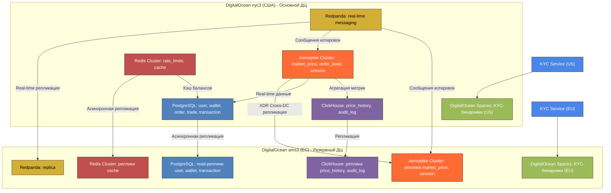

# Курсовая работа по курсу "Проектирование высоконагруженных систем"  
**Студент**: Фролов И.О. WEB-31 (Осень 2025)  
# CoinBase (Централизованная криптовалютная биржа)

---

## 1. Тема и целевая аудитория

**Тип сервиса**: Криптовалютная биржа и кошелек  
**Целевая аудитория**: Глобальная (США и ЕС в приоритете, за исключением стран с полным запретом криптовалюты) [1]  

- **MAU (Monthly Active Users)**: **120 миллионов** — общее число пользователей, взаимодействующих с платформой ежемесячно (просмотр курсов, портфеля, новостей) [1]  
- **MTU\* (Monthly Transacting Users)**: **8.7 миллионов** — пользователи, совершающие хотя бы одну торговую операцию в месяц (Q2 2025) [1]  
- **DAU (Daily Active Users)**: **~4.3 миллиона** — консервативная оценка, основанная на предположении, что 50% активных трейдеров (MTU) заходят ежедневно для торговли или мониторинга позиций [1]  

> **Примечание**: Coinbase перешла на отчетность по MTU как ключевой метрике активности, так как именно транзакционные пользователи генерируют основной доход. Большинство из 120M MAU — пассивные держатели или читатели контента.

**Ключевой функционал**: Торговые операции с криптовалютой (купля/продажа, обмен, вывод)  
**Ключевое продуктовое решение**: Хранение средств пользователей на кошельках платформы с внутренним matching engine для исполнения ордеров [3]

**Основной функционал MVP**:
- **Аутентификация и KYC**: Регистрация, верификация личности, управление доступом
- **Управление балансами**: Пополнение и вывод фиатных валют (USD, EUR), криптовалютные операции
- **Торговая платформа**: Покупка/продажа по рыночной цене с минимальной задержкой исполнения
- **Криптовалютные переводы**: Отправка и получение средств на внешние кошельки
- **История операций**: Просмотр транзакций, текущих балансов и торговой активности
- **Рыночные данные**: Получение актуальных курсов в реальном времени
- **Монетизация**: Комиссии за исполнение ордеров и финансовые операции

**Архитектурная стратегия**: Глобальная распределенная система с фокусом на низкую задержку и отказоустойчивость, соответствующая требованиям финансовых регуляторов (SEC, MiCA, GDPR).

---

## 2. Расчет нагрузки

**Продуктовые метрики (на основе данных Q2 2025 и усреднённых показателей 2025 года)**:

- **Ежемесячный объем торговли (Trading Volume)**: ~$310 млрд в месяц (усреднённый показатель за 2025 год) [1]  
- **Transaction Revenue (доход от комиссий)**: **$6.71 млрд TTM** → **~$560 млн в месяц** [1]  
- **Средняя комиссия**: **~0.18%** ($560 млн / $310 млрд)  
- **Средний объем торговли на одного MTU**: **~$35,632 в месяц** ($310 млрд / 8.7 млн MTU) [1]  
- **Средний размер сделки**: **$115** — типичный чек для розничного трейдера на Coinbase  
- **Ежемесячное количество сделок**: **~2.7 миллиарда** ($310 млрд / $115)  
- **Число верифицированных пользователей**: **120 миллионов** [1]  
- **Количество поддерживаемых криптоактивов**: **313** (для MVP 250+) [1]  

> **Примечание**: В архитектуре matching engine под "сделкой" может пониматься исполнение части ордера — общее число ордеров может быть меньше.

### Продуктовые метрики

| Метрика | Значение | Комментарий / Источник |
|--------|----------|-------------------------|
| **MAU (Monthly Active Users)** | 120 млн | Все пользователи, заходящие на платформу хотя бы раз в месяц [1] |
| **MTU (Monthly Transacting Users)** | 8.7 млн | Пользователи, совершившие хотя бы 1 торговую операцию в месяц (Q2 2025) [1] |
| **DAU (Daily Active Users)** | ~4.35 млн | Оценка: 50% от MTU заходят ежедневно для торговли/мониторинга [1] |
| **Средний размер хранилища на пользователя** | **~10 MB** | 8.5 MB (KYC + профиль) + 1.5 MB (720 транзакций) |
| **Среднее количество действий на DAU в день** | | |
| — Просмотр курсов / портфеля | 20 запросов | UI-запросы к API цен и балансов |
| — Торговые операции | 24 операции | Создание и исполнение ордеров |
| — Пополнение/вывод фиата | 0.05 операций | Через банковские шлюзы |
| — Перевод криптовалюты | 0.03 операций | On-chain транзакции |

### Технические метрики: Размер хранения данных

| Тип данных | Кол-во записей | Средний размер | Общий объем | Комментарий |
|------------|----------------|----------------|-------------|-------------|
| **Пользовательские профили** | 120 млн | 8.5 MB | **~1.02 PB** | Документы, фото, метаданные (KYC + профиль) |
| **История транзакций** | 32.4 млрд/год | 22 байта | **~0.71 TB/год** | Метаданные транзакций (`tx_id`, `user_id`, `wallet_id`, `amount`, `currency`, `timestamp`, `status`) |
| **Ордера (ежемесячно)** | 2.7 млрд | 256 байт | **~691 GB/мес** → **~8.3 TB/год** | Архивация после исполнения |
| **Котировки в реальном времени** | 1.3 млрд/день | 32 байта | **~42 GB/день** → **~15.3 TB/год** | Изменения цен с минимальной задержкой (1 обновление/сек на пару × 250 пар × 86,400 сек) |
| **Логи действий пользователей** | 189.5 млн/день | 512 байт | **~97.0 GB/день** → **~35.4 TB/год** | Аналитика, безопасность, compliance (все операции DAU × ~44 действий/день) |
| **Метрики мониторинга** | ~500K samples/сек | 16 байт | **~20 TB/год** | VictoriaMetrics с 10x сжатием |
| **ИТОГО (активные + архивные данные)** | — | — | **~1.12 PB** | Основной объем — профили и KYC (1.02 PB), остальное ~100 TB |

### Сетевой трафик

#### Пиковое потребление в течение суток

| Тип трафика | Пиковая нагрузка | Расчёт | Комментарий |
|-------------|------------------|--------|-------------|
| **UI/API запросы** | 13.0 Гбит/с | `(4.35M × 20 × 2 KB × 8 бит) / (86400 × 0.1)` | Conservative estimation: 2 KB на ответ (включая заголовки и gzip-оверхед) |
| **Торговые ордера** | 17.0 Гбит/с | `(4.35M × 24 × 0.5 KB × 8 бит) / (86400 × 0.1)` | Размер ордера: ~512 байт (JSON + метаданные) |
| **Поток цен WebSocket** | 5.2 Гбит/с | `4.35M × 15 × 100 байт × 8 бит / 0.1` | Среднее 15 активных подписок/пользователь; 100 байт/сообщение |
| **Репликация данных** | 3.0 Гбит/с | Оценка на основе ETL-процессов | Меж-DC синхронизация |
| **ИТОГО ПИКОВАЯ НАГРУЗКА** | **~38.2 Гбит/с** | — | Требуется инфраструктура с запасом 40+ Гбит/с (включая 0.6 Гбит/с служебного трафика) |

> **Коэффициент пиковой нагрузки = 0.1** — пик в 10× выше среднего (стандарт для финтех-систем).

#### Суточный трафик

| Тип трафика | Суточный объем | Расчёт |
|-------------|----------------|--------|
| UI/API запросы | 1780 ГБ | 4.35M × 20 × 2 KB |
| Торговые ордера | 534 ГБ | 4.35M × 24 × 0.5 KB |
| Поток цен | 564 ГБ | 4.35M × 15 × 100 байт × 86400 / 10⁹ |
| Репликация данных | 300 ГБ | Оценка |
| **ИТОГО** | **~3178 ГБ/сутки** | — |

### RPS (Requests Per Second)

| Тип запроса | Средний RPS | Пиковый RPS | Расчёт | Комментарий |
|-------------|-------------|-------------|--------|-------------|
| **Получение курсов / баланса** | 10,069 RPS | 100,690 RPS | `(4.35M × 20) / 86400` | Основная нагрузка на API-шлюзы |
| **Создание ордеров** | 12,083 RPS | 120,830 RPS | `(4.35M × 24) / 86400` | Нагрузка на matching engine |
| **Операции с фиатом** | 25 RPS | 250 RPS | `(4.35M × 0.05) / 86400` | Интеграция с банковскими API |
| **Криптовалютные переводы** | 15 RPS | 150 RPS | `(4.35M × 0.03) / 86400` | On-chain транзакции |
| **WebSocket рассылка (msg/s)** | 65.25M msg/s | 652.5M msg/s | `4.35M × 15` | Исходящие сообщения рассылки цен (15 активных пар/пользователь, ~1 msg/сек/пара) |
| **Аутентификация** | 5,000 RPS | 50,000 RPS | Оценка на основе DAU | Нагрузка на сервис аутентификации |

**Ключевые выводы по нагрузке**:
- **Пиковая сетевая нагрузка**: ~38 Гбит/с требует 40+ Гбит/с инфраструктуры
- **Хранилище данных**: ~1.12 PB в год с доминированием KYC-данных
- **Критическая нагрузка**: 120.8K RPS на создание ордеров требует high-performance matching engine
- **WebSocket-трафик**: 65M+ сообщений/сек (msg/s), а не RPS — исходящая рассылка цен

---

## 3. Глобальная балансировка нагрузки

### Архитектурная стратегия: Active-Passive

**Основной принцип**: Все операции записи направляются в активный ДЦ `nyc3`, операции чтения обслуживаются ближайшим ДЦ.

### Функциональное разбиение по доменам

| Домен | Ответственность | Критичность | Особенности маршрутизации |
|-------|------------------|-------------|---------------------------|
| **Auth & KYC** | Аутентификация, верификация | High | Write → `nyc3`, Read → ближайший ДЦ |
| **Trading Engine** | Исполнение ордеров, стаканы | Critical | Только `nyc3` (централизованный) |
| **Wallet & Custody** | Балансы, транзакции | Critical | Write → `nyc3`, Read → ближайший ДЦ |
| **Market Data** | Цены в реальном времени | High | Anycast, ближайший ДЦ |
| **User Activity** | Аудит, аналитика | Medium | Write → Home Region |

### Распределение инфраструктуры по ДЦ

**DigitalOcean `nyc3` (США) - Активный ДЦ**:
- Matching Engine (основной)
- PostgreSQL мастер для финансовых данных
- Aerospike мастер для котировок
- Банковские интеграции (US-focused)

**DigitalOcean `ams3` (ЕС) - Пассивный ДЦ**:
- Read-реплики PostgreSQL
- Aerospike реплика
- Кэши Redis
- Резервный Matching Engine

### Распределение нагрузки по ДЦ

| Тип запроса | Общий RPS | `nyc3` | `ams3` | Особенности |
|-------------|-----------|--------|--------|-------------|
| **Чтение курсов/балансов** | 100,690 | 70,483 | 25,173 | Ближайший ДЦ |
| **Создание ордеров** | 120,830 | 120,830 | 0 | Только `nyc3` |
| **WebSocket цены** | 65,250,000 | 45,675,000 | 16,312,500 | Anycast, ближайший ДЦ |
| **Аутентификация** | 50,000 | 35,000 | 12,500 | Ближайший ДЦ |

### Схема маршрутизации трафика

### Схема DNS-балансировки

Используется **географическая DNS-балансировка** через Cloudflare Load Balancing:

**Процесс маршрутизации**:
- Запрос к `api.coinbase.com` → Cloudflare определяет геолокацию по IP
- Возвращает IP-адрес ближайшего Load Balancer:
  - **США/Канада** → Load Balancer в `nyc3`
  - **Европа** → Load Balancer в `ams3` 
  - **Остальные регионы** → Load Balancer в `nyc3` (fallback)

**Обработка write-запросов**:
- Европейские пользователи → `ams3` → локальное обсуживание, но matching в `nyc3`
- Американские пользователи → `nyc3` → прямое обслуживание

**Преимущества**:
- Минимизация задержки для read-операций
- Изоляция сбоев по регионам
- Централизация финансовых операций для compliance
- Простота управления и мониторинга

### Схема Anycast-балансировки

Для **WebSocket-потока цен** и **публичных API котировок** применяется **Anycast** через Cloudflare Spectrum:

**Техническая реализация**:
- Один IP-адрес объявляется глобально через BGP маршрутизацию
- Трафик автоматически направляется к ближайшему PoP Cloudflare
- Серверы в `nyc3` и `ams3` синхронизируют данные через Redpanda
- Задержка репликации: 70-100 мс (приемлемо для UI котировок)

**Архитектура репликации котировок**:
- **Источник данных**: Matching Engine в `nyc3`
- **Трансляция**: Redpanda → Aerospike в обоих ДЦ
- **Синхронизация**: Асинхронная с конфликт-разрешением по timestamp
- **Консистентность**: Eventual consistency для цен

**Эффект**:
- Задержка доставки цены < 10 мс в пределах региона
- Устойчивость к DDoS-атакам через рассеивание трафика
- Прозрачность для клиента (единая точка входа)

> Anycast используется исключительно для **read-only** данных. Все операции записи (ордера, транзакции) направляются через гео-DNS в домашний регион пользователя.

### Механизм регулировки трафика между ДЦ

Для обеспечения отказоустойчивости и балансировки при пиковой нагрузке используется многоуровневая система управления трафиком:

#### 1. Health Monitoring и Failover
- **Cloudflare Health Checks**: HTTP/HTTPS проверки каждые 5 секунд
- **Custom Health Endpoints**: `/health` для критичных сервисов с метриками нагрузки
- **Автоматический failover**: При недоступности ДЦ за 15 секунд
- **Graceful degradation**: Частичное обслуживание при деградации сервисов

#### 2. Weighted Routing и Load Shedding
- **Динамическое взвешивание**: На основе метрик CPU, памяти, RPS
- **Пороги срабатывания**: При загрузке >80% в `nyc3`
- **Перенаправление трафика**: Часть read-запросов в `ams3` с уведомлением о задержке
- **Circuit Breaker**: Автоматическое отключение проблемных эндпоинтов

#### 3. Rate Limiting и Protection
- **Cloudflare Rate Limiting**: 10K RPS на IP, 100 RPS на пользователя
- **WAF правила**: Защита от API-злоупотреблений
- **Bot Management**: JS Challenge для подозрительного трафика
- **DDoS Protection**: Автоматическое поглощение атак L3/L4

#### 4. Кэширование и оптимизация
- **Глобальный кэш цен**: Cloudflare CDN с TTL 1-2 секунды
- **Edge Caching**: Статика и публичные данные на edge-нодах
- **Origin Shield**: Защита origin-серверов от повторных запросов

**Метрики мониторинга**:
- Latency percentiles (p50, p95, p99)
- Error rate по регионам и сервисам
- Capacity utilization каждого ДЦ
- Traffic distribution в реальном времени

Такой подход обеспечивает **доступность 99.99%** и **предсказуемую производительность** даже при экстремальной волатильности рынка и всплесках нагрузки.

---

## 4. Локальная балансировка нагрузки

### Архитектура балансировки внутри ДЦ

Локальная балансировка реализуется в каждом дата-центре через многоуровневую архитектуру:

#### 1. **L4 Load Balancer (Envoy Proxy)**
- **Роль**: Первичное распределение TCP-трафика от Cloudflare
- **Конфигурация**: 2 инстанса в active/passive режиме с hot standby
- **TLS**: Termination на Cloudflare, работа в plain TCP mode
- **Преимущества**: Низкая задержка, интеграция с service mesh
- **Резервирование**: **N+1** (1 активный + 1 горячий резерв)

#### 2. **NGINX Ingress Controller (L7)**
- **Развертывание**: DaemonSet на выделенных нодах Kubernetes
- **Функциональность**: Маршрутизация по хостам и путям, WebSocket поддержка
- **Оптимизации**: `keepalive_requests=1000000`, `tcp_nodelay=on`, `access_log off`
- **Резервирование**: **N*2** (минимум 2 инстанса в разных зонах доступности)

#### 3. **Service Mesh (Cilium + eBPF)**
- **Архитектура**: eBPF-based dataplane вместо kube-proxy
- **Преимущества**: O(1) сложность маршрутизации, L7 observability через Hubble
- **Критичные сервисы**: Envoy sidecar для Matching Engine с gRPC load balancing
- **Latency**: < 0.1 мс для межсервисной коммуникации

### Интеграция Envoy в архитектуру

#### **Envoy как L4 балансировер**:
- **Listener Configuration**: TCP проксирование на NGINX Ingress
- **Health Checking**: Активные проверки upstream сервисов
- **Metrics**: Подробная статистика через /stats endpoint
- **Dynamic Configuration**: xDS API для управления маршрутизацией

#### **Envoy Sidecar для критичных сервисов**:
- **Matching Engine**: gRPC load balancing с weighted round-robin
- **Circuit Breaking**: Автоматическое отключение проблемных инстансов
- **Retry Policies**: Экспоненциальный backoff для торговых операций
- **Observability**: Distributed tracing через OpenTelemetry

### Расчёт емкости балансировщиков

#### SSL Termination Capacity

**Исходные данные**:
- NGINX производительность: **56,700 SSL TPS** на 24 CPU [6]
- Коэффициент keep-alive: **25%** новых соединений от общего RPS

**Расчет для `nyc3`**:
- HTTPS RPS: `(100,690 + 120,830 + 50,000) × 0.7 = 190,264 RPS`
- Новые TLS-соединения: `190,264 × 0.25 = 47,566 TPS`
- Требуемая емкость: `47,566 / 56,700 = 84%` от capacity одного инстанса

**Расчет для `ams3`**:
- HTTPS RPS: `271,520 × 0.25 = 67,880 RPS` 
- Новые TLS-соединения: `67,880 × 0.25 = 16,970 TPS`
- Требуемая емкость: `16,970 / 56,700 = 30%` от capacity одного инстанса

#### Сетевая пропускная способность

**Пиковая нагрузка**:
- Глобальная: **12.8 Гбит/с** (из раздела 2)
- `nyc3`: `12.8 × 0.7 = 9.0 Гбит/с`
- `ams3`: `12.8 × 0.25 = 3.2 Гбит/с`

**NGINX производительность сети** [5]:
- 16+ CPU: **70-72 Гбит/с** на 2×40G интерфейсах
- Запас пропускной способности: 7.8x для `nyc3`, 22x для `ams3`

### Итоговая конфигурация

| ДЦ | Компонент | Кол-во | CPU | Сеть | Резервирование |
|----|-----------|--------|-----|------|----------------|
| **`nyc3`** | Envoy L4 LB | 2 | 8 core | 2×10G | N+1 |
| | NGINX Ingress | 2 | 24 core | 2×40G | N*2 |
| | Envoy Sidecars | 20+ | 2 core | - | Per-pod |
| **`ams3`** | Envoy L4 LB | 2 | 8 core | 2×10G | N+1 |
| | NGINX Ingress | 2 | 24 core | 1×40G | N*2 |
| | Envoy Sidecars | 15+ | 2 core | - | Per-pod |

### Обоснование стратегий резервирования

#### **N+1 для Envoy L4 Load Balancer**
- **Причина**: Stateless компонент с hot standby конфигурацией
- **Преимущества Envoy**: Единая технология для L4 и service mesh
- **Время восстановления**: < 1 секунда через health checking
- **Консистентность**: Одинаковая конфигурация на всех инстансах

#### **N*2 для NGINX Ingress и критичных сервисов**
- **Причина**: Stateful L7 маршрутизация с sticky sessions
- **Требования к доступности**: 99.99% для финансовых операций
- **Распределение нагрузки**: Active-Active для горизонтального масштабирования
- **Географическая устойчивость**: Размещение в разных зонах доступности

#### **Envoy Sidecar для критичных сервисов**:
- **Matching Engine**: Локальная балансировка между репликами
- **Circuit Breaking**: Защита от каскадных отказов
- **Observability**: Единая точка сбора метрик и трассировки
- **Consistent Configuration**: Управление через xDS API

#### **Дополнительные меры отказоустойчивости**:
- **Pod Anti-Affinity**: Гарантированное распределение по нодам
- **Topology Spread Constraints**: Балансировка по зонам доступности
- **Pod Disruption Budget**: Минимум 1 доступный pod для критичных сервисов
- **Resource Guarantees**: Guaranteed QoS класс для Matching Engine

**Итоговая доступность архитектуры**: 99.99% через многоуровневое резервирование и автоматическое восстановление с единой Envoy-based инфраструктурой.

---

## 5. Логическая схема БД

**Стратегия распределения данных**
Для обеспечения консистентности финансовых операций все данные, связанные с торговлей, централизованы в основном ДЦ (`nyc3`). KYC-данные хранятся в регионе пользователя для compliance.

- **Данные в основном ДЦ (`nyc3`)**: `user`, `wallet`, `transaction`, `order`, `trade`, `withdrawal_request`, `bank_account`
- **KYC-данные в Home Region**: `kyc_document` (метаданные + бинарники в региональном Spaces)
- **Глобально реплицируемые/кэшируемые данные**: `currency`, `market_price`, `price_history`, `audit_log`, `session`

// TODO: добавить регион пользователя в таблицу

### Описание таблиц

| Таблица | Назначение | Кол-во строк (оценка) | Средний размер записи | Общий объем | QPS (чтение / запись) | Консистентность | Особенности распределения |
|--------|------------|------------------------|------------------------|--------------|------------------------|------------------|----------------------------|
| user | Профили пользователей | 120 млн | ~1 KB | ~120 GB | 10K / 50 | **Strong** | Шардирование по `user_id`. Данные хранятся и обрабатываются исключительно в Home Region пользователя. |
| session | Сессии пользователей | 5 млн | ~0.3 KB | ~1.5 GB | 1.3K / 1K | **Strong** | `JWT Access + WhiteList Refresh Токенов. Реплицируется в оба ДЦ для низкой задержки авторизации. |
| kyc_document | KYC-документы (метаданные) | 360 млн | ~0.5 KB | ~180 GB | 100 / 200 | **Strong** | Шардирование по `user_id`. Данные хранятся в Home Region пользователя. Бинарники — в региональном объектном хранилище (Spaces). |
| currency | Справочник валют (250+ активов) | 250+ | ~0.1 KB | < 1 MB | 1K / 1 | **Strong** | Реплицируется во все регионы как read-only справочник. |
| wallet | Балансы по валютам | 30 млрд | ~0.3 KB | ~9 TB | 121K / 121K | **Strong** | Шардирование по `(user_id, currency_code)`. Данные хранятся в Home Region пользователя. Кэш в Redis. |
| order | Активные и завершённые ордера | 2.7 млрд/мес | ~0.25 KB | ~691 GB/мес | 121K / 121K | **Strong** | Шардирование по валютной паре. Все шарды расположены в основном ДЦ (`nyc3`). |
| trade | Исполненные сделки | 2.7 млрд/мес | ~0.3 KB | ~830 GB/мес | 5K / 121K | **Strong** | Шардирование по валютной паре. Все шарды расположены в основном ДЦ (`nyc3`). Партиционирование по дате. |
| transaction | Все транзакции (депозиты, выводы, комиссии) | 86.4 млрд | ~0.2 KB | ~17.3 TB | 50 / 12K | **Strong** | Шардирование по `user_id`. Данные хранятся в Home Region пользователя. |
| bank_account | Банковские реквизиты для фиата | 24 млн | ~0.3 KB | ~7 GB | 10 / 25 | **Strong** | Шардирование по `user_id`. Данные хранятся в Home Region пользователя. |
| withdrawal_request | Заявки на вывод криптовалюты | 95 млн/мес | ~0.3 KB | ~28 GB/мес | 10 / 15 | **Strong** | Шардирование по `user_id`. Данные хранятся в Home Region пользователя. |
| market_price | Текущие котировки | ~62.5 тыс. | ~0.1 KB | ~6 MB | 100K / 1K | **Eventual** (UI), **Strong** (торговля) | Реплицируется в регионы из основного ДЦ. |
| price_history | История цен (1 обновление/сек на пару) | 1.3 млрд/день | ~0.1 KB | ~47.5 TB/год | 1K / 1.3M | **Best-effort** | Партиционирование по дате; реплицируется для аналитики; архив в cold storage. |
| audit_log | Логи действий (compliance, безопасность) | 189.5 млн/день | ~0.5 KB | ~35.4 TB/год | 10 / 200K | **Best-effort** | Централизованная запись через Redpanda → ClickHouse в основном ДЦ, репликация для аналитики. |

- **Файловые данные**: все бинарные файлы (KYC-сканы) хранятся в **региональном объектном хранилище** (DigitalOcean Spaces), в БД — только метаданные (`storage_path`). KYC-документы пользователя хранятся в том же регионе, что и его Home Region.
- **Кеши и буферы**:  
  - Балансы (`wallet`) — кэшируются в **Redis Cluster** с write-through в Home Region пользователя.  
  - Курсы (`market_price`) — кэшируются в **Redis + CDN** (Cloudflare) во всех регионах.  
- **Консистентность**:  
  - **Strong** — для всех финансовых операций (кошельки, ордера, транзакции).  
  - **Eventual / Best-effort** — для UI, аналитики и логов.
- **Распределение по регионам**:
  - **Home Region пользователя**: `user`, `kyc_document`, `wallet`, `transaction`, `bank_account`, `withdrawal_request`
  - **Основной ДЦ (nyc3)**: `order`, `trade` (централизованный matching engine)
  - **Глобальная репликация**: `currency`, `market_price`, `price_history`, `audit_log`
- **Горячие ключи**: популярные валюты (BTC, ETH, USD) выносятся в отдельные шарды или обрабатываются в выделенных matching engine.  
- **Архив**: данные старше 90 дней (ордера, транзакции, логи) архивируются в **OLAP + S3**.

---

## 6. Физическая схема БД

Физическая схема отражает выбор СУБД, индексов, шардирования и резервирования с учётом:
- архитектуры **Active-Passive** с основным ДЦ `nyc3` и резервным `ams3`
- стратегии **Home Region** для данных пользователей
- требований к **strong consistency** для финансовых операций
- необходимости **предсказуемой низкой задержки** (<1 мс) для торговых операций
- обработки пиковых нагрузок до **121K QPS** на запись
- соответствия регуляторным требованиям (GDPR, SEC)

### 6.1 Выбор СУБД по таблицам

| Таблица | СУБД | Обоснование | Размещение |
|--------|------|-------------|------------|
| `user` | **PostgreSQL** | Strong consistency, уникальность email, KYC-связность, сложные запросы. | **Home Region пользователя** |
| `session` | **Aerospike** | Predictable low latency (<1 мс), TTL, high throughput для аутентификации. | **Оба ДЦ** с синхронной репликацией |
| `kyc_document` | **PostgreSQL** | Strong consistency, ссылочная целостность с `user`. | **Home Region пользователя** |
| `currency` | **PostgreSQL (read replica)** | Справочник с редкими изменениями, сложные отношения. | **Репликация в оба ДЦ** |
| `wallet` | **PostgreSQL + Aerospike (cache)** | Strong consistency + predictable latency для проверки балансов. | **Home Region пользователя** |
| `order` | **PostgreSQL (шардированная)** | ACID, сложные транзакции, JOIN с trade. | **Только nyc3** |
| `trade` | **PostgreSQL (шардированная)** | Strong consistency, аналитические запросы. | **Только nyc3** |
| `order_book` | **Aerospike** | In-memory с persistence, predictable low latency (<0.5 мс) для matching engine. | **nyc3 (мастер) + ams3 (реплика)** |
| `market_price` | **Aerospike** | High throughput (1M+ ops/sec), strong consistency, real-time обновления. | **Оба ДЦ** с синхронной репликацией |
| `transaction` | **PostgreSQL** | Strong consistency, аудиторский след. | **Home Region пользователя** |
| `bank_account` | **PostgreSQL** | Чувствительные данные, сложная валидация. | **Home Region пользователя** |
| `withdrawal_request` | **PostgreSQL** | Статус-машина, compliance требования. | **Home Region пользователя** |
| `price_history` | **ClickHouse** | Высокая скорость вставки, аналитика по времени. | **nyc3 + реплика в ams3** |
| `audit_log` | **ClickHouse** | High write throughput (200K QPS), аналитика. | **nyc3 + реплика в ams3** |

### 6.2 Индексы

| Таблица | Индексы | Обоснование |
|--------|--------|-------------|
| `user` | `PK (user_id)`, `UNIQUE (email)`, `INDEX (home_region)` | Поиск по ID, email и региону для маршрутизации |
| `session` | `PK (session_token)`, `SECONDARY INDEX (user_id)` | Быстрая валидация сессий, отзыв по user_id |
| `kyc_document` | `PK (doc_id)`, `INDEX (user_id)` | Получение документов пользователя |
| `currency` | `PK (code)` | Быстрый lookup по коду валюты |
| `wallet` | `PK (wallet_id)`, `UNIQUE (user_id, currency_code)` | Уникальность кошелька на пару (пользователь, валюта) |
| `order` | `PK (order_id)`, `INDEX (base_currency, quote_currency, status, price)`, `INDEX (user_id)` | Составной индекс для стакана, поиск ордеров пользователя |
| `trade` | `PK (trade_id)`, `INDEX (executed_at)`, `INDEX (buyer_user_id)`, `INDEX (seller_user_id)` | Аналитика по времени и пользователям |
| `order_book` | `PK (currency_pair)`, `INDEX (best_bid)`, `INDEX (best_ask)` | Быстрый доступ к стакану, поиск лучших цен |
| `market_price` | `PK (currency_pair)` | Хэш-доступ к текущим ценам |
| `transaction` | `PK (tx_id)`, `INDEX (user_id)`, `INDEX (wallet_id)` | Поиск транзакций по пользователю и кошельку |
| `price_history` | `PRIMARY KEY (timestamp, base_currency, quote_currency)` | Эффективное партиционирование по времени |
| `audit_log` | `PRIMARY KEY (created_at, user_id)` | Быстрый поиск логов по времени и пользователю |

### 6.3 Денормализация

| Источник | Денормализация | Комментарий |
|---------|----------------|-------------|
| `order` → `trade` | В `trade` дублируются `price`, `amount`, `base_currency`, `quote_currency` | Избегаем JOIN при аналитике сделок |
| `user` → `order` / `trade` | В `order` и `trade` хранятся `user_id`, `home_region` | Маршрутизация запросов без cross-region lookup |
| `wallet` → `transaction` | В `transaction` хранится `balance_after`, `currency_code` | Аудит баланса без реконструкции истории |
| `order_book` → `market_price` | В `market_price` дублируются `best_bid`, `best_ask` | Быстрый доступ к лучшим ценам без запроса к стакану |
| `user` → `session` | В `session` хранится `home_region`, `permissions` | Быстрая проверка прав доступа |

### 6.4 Шардирование и резервирование

| Таблица | Тип шардирования | Цель | Резервирование |
|--------|------------------|------|----------------|
| `user`, `kyc_document`, `bank_account` | **Хэш по `user_id`** | Изоляция по Home Region | PostgreSQL: 1 мастер + 2 синхронные реплики в регионе |
| `wallet`, `transaction`, `withdrawal_request` | **Хэш по `user_id`** | Все операции пользователя в одном шарде | То же |
| `order`, `trade` | **Хэш по `(base_currency, quote_currency)`** | Matching engine по валютным парам | PostgreSQL: 1 мастер + 2 реплики в `nyc3` |
| `order_book`, `market_price` | **Хэш по `currency_pair`** (Aerospike) | Распределение нагрузки по парам | Aerospike: 2 реплики (master в `nyc3`, replica в `ams3`) |
| `session` | **Хэш по `session_token`** (Aerospike) | Балансировка сессий | Aerospike: 2 реплики в каждом ДЦ |
| `price_history`, `audit_log` | **Партиционирование по дате** | Эффективное хранение | ClickHouse: 2 реплики (nyc3 + ams3) |
| `currency` | **Нет шардирования** | Справочник | PostgreSQL: read replica в каждом ДЦ |

### 6.5 Клиентские библиотеки / интеграции

| СУБД | Библиотеки | Особенности |
|------|-----------|-------------|
| **PostgreSQL** | `asyncpg` (Python), `pgx` (Go) | Connection pooling с учетом Home Region |
| **Aerospike** | `aerospike-client-python`, `aerospike-client-go` | Predictable latency, built-in clustering |
| **ClickHouse** | `clickhouse-connect` (Python), `clickhouse-go` (Go) | HTTP API, bulk inserts |
| **DigitalOcean Spaces** | `boto3` (Python) | Региональные endpoint'ы |

### 6.6 Балансировка запросов / мультиплексирование

| СУБД | Механизм | Особенности |
|------|----------|-------------|
| **PostgreSQL** | **PgBouncer** + **HAProxy** | Read-запросы → ближайшая реплика, Write → мастер в Home Region |
| **Aerospike** | **Smart Clients** | Automatic traffic routing, read from local replica |
| **ClickHouse** | **Distributed таблицы** | Запись в основной ДЦ, чтение из ближайшей реплики |
| **DigitalOcean Spaces** | **Региональные endpoint'ы** | Запись в Spaces того же региона |

### 6.7 Схема резервного копирования

| СУБД | Стратегия | Retention |
|------|----------|-----------|
| **PostgreSQL** | WAL-архивирование + **pgBackRest** | 30 дней, cross-region реплика |
| **Aerospike** | **XDR (Cross Datacenter Replication)** | Real-time репликация + ежедневные снапшоты |
| **ClickHouse** | **clickhouse-backup** | 7 дней, инкрементальные бэкапы |
| **DigitalOcean Spaces** | **Versioning + Lifecycle** | 90 дней, автоматический переход в Glacier |

### 6.8 Региональная специфика хранения

**DigitalOcean `nyc3` (основной ДЦ)**:
- Все мастер-шарды PostgreSQL для US пользователей и торговых данных
- Aerospike мастер-ноды для `order_book`, `market_price`
- Основные инстансы ClickHouse
- Spaces бакет для US пользователей

**DigitalOcean `ams3` (резервный ДЦ)**:
- Read-реплики PostgreSQL для EU пользователей
- Aerospike реплики для критичных данных
- Реплики ClickHouse для аналитики
- Spaces бакет для EU пользователей

**Ключевые метрики производительности**:
- **Aerospike**: <1 мс latency для цен и стаканов
- **PostgreSQL**: <10 мс для финансовых операций
- **ClickHouse**: 1M+ rows/sec вставки для логов
- **Cross-region репликация**: 70-100 мс задержка

---

## 7. Алгоритмы

| Алгоритм | Область применения | Детальное описание |
|----------|---------------------|---------------------|
| **Consistent Hashing с виртуальными узлами** | Горизонтальное шардирование данных пользователей по Home Region и торговых данных по валютным парам | Consistent Hashing минимизирует перераспределение данных при изменении топологии кластера. Алгоритм отображает узлы и ключи на кольцо, где каждый ключ присваивается первому узлу по часовой стрелке. Для выравнивания нагрузки используются виртуальные узлы (128-256 на физический узел). В Coinbase применяется для шардирования пользовательских данных по Home Region (`user_id`) и торговых данных по валютным парам в основном ДЦ `nyc3`. |
| **Home Region Routing** | Маршрутизация запросов пользователей между географическими регионами | Алгоритм определяет оптимальный маршрут для обработки запросов на основе Home Region пользователя. Write-операции всегда направляются в Home Region пользователя, read-операции могут обслуживаться из ближайшего ДЦ. Алгоритм учитывает геолокацию, регуляторные требования (GDPR) и текущую нагрузку на ДЦ для балансировки трафика. |
| **Adaptive Order Book Partitioning** | Динамическое распределение нагрузки в Matching Engine по валютным парам | Алгоритм решает проблему "горячих шардов" при всплесках волатильности через динамическое перераспределение стаканов между инстансами Matching Engine. На основе метрик RPS, глубины стакана и latency система автоматически мигрирует "горячие" валютные пары на выделенные инстансы с гарантированными ресурсами. |

### Consistent Hashing с виртуальными узлами

В распределенной архитектуре Coinbase consistent hashing обеспечивает эффективное распределение данных с учетом стратегии Home Region и Active-Passive топологии.

#### Применение в различных доменах:

**Пользовательские данные (Home Region)**:
- Таблицы `user`, `wallet`, `transaction` шардируются по `user_id` с учетом Home Region
- Гарантирует локализацию всех данных пользователя в одном географическом регионе
- Обеспечивает соответствие регуляторным требованиям (GDPR)

**Торговые данные (централизованные)**:
- Таблицы `order`, `trade` шардируются по валютным парам в основном ДЦ `nyc3`
- Обеспечивает консистентность данных для matching engine
- Позволяет независимое масштабирование по валютным парам

**Кэширование и сессии**:
- Aerospike и Redis используют consistent hashing для распределения нагрузки
- Сессии пользователей распределяются равномерно между узлами кластера
- Горячие валютные пары не создают точек насыщения

#### Преимущества для архитектуры Active-Passive:

- **Масштабируемость**: Добавление новых шардов затрагивает только соседние узлы на кольце
- **Отказоустойчивость**: Равномерное распределение нагрузки при выходе узлов из строя
- **Производительность**: Минимизация cross-region запросов за счет локализации данных
- **Compliance**: Автоматическое соблюдение требований к хранению данных по регионам

### Home Region Routing

Алгоритм маршрутизации запросов между ДЦ `nyc3` и `ams3` обеспечивает оптимальную производительность при соблюдении консистентности данных.

#### Принципы работы:

**Определение Home Region**:
- При регистрации пользователю назначается Home Region на основе геолокации
- Для пользователей из США и Канады - `nyc3`, из Европы - `ams3`
- Учитываются регуляторные требования (GDPR для EU пользователей)

**Маршрутизация запросов**:
- Write-операции (торговля, пополнение, KYC) всегда направляются в Home Region
- Read-операции (просмотр балансов, котировок) могут обслуживаться из ближайшего ДЦ
- Торговые операции централизованы в `nyc3` для гарантии консистентности

**Балансировка нагрузки**:
- При перегрузке одного ДЦ часть read-трафика перенаправляется в другой регион
- Write-трафик всегда сохраняется в Home Region для strong consistency
- Health checks обеспечивают автоматический failover при сбоях

#### Интеграция с глобальной балансировкой:

Алгоритм работает совместно с Cloudflare Load Balancing, обеспечивая:
- Географическую маршрутизацию на основе IP-адреса пользователя
- Автоматический failover между ДЦ при сбоях
- Rate limiting и защиту от DDoS-атак
- Кэширование статических данных на edge-нодах

### Adaptive Order Book Partitioning

Алгоритм решает проблему неравномерной нагрузки на matching engine при высокой волатильности рынка.

#### Механизм динамической балансировки:

**Мониторинг метрик**:
- Prometheus собирает метрики RPS, latency и глубины стакана для каждой валютной пары
- Пороговые значения: 50K RPS, 0.5 мс latency, 10K ордеров в стакане
- Мониторинг осуществляется каждые 10-30 секунд

**Принятие решений о миграции**:
- При превышении порогов пара помечается как "горячая"
- Система оценивает доступные ресурсы в кластере Kubernetes
- Выбирается целевой инстанс с гарантированными CPU ресурсами

**Процесс миграции**:
1. Создание реплики стакана на целевом инстансе Matching Engine
2. Атомарное переключение маршрутизации новых ордеров
3. Завершение исполнения остатков на старом инстансе
4. Мониторинг стабилизации нагрузки

**Интеграция с инфраструктурой**:
- Kubernetes обеспечивает изоляцию ресурсов через CPU pinning
- Envoy управляет динамической маршрутизацией ордеров
- Service mesh (Cilium) обеспечивает низкую задержку коммуникации

#### Преимущества для торговой платформы:

- **Гарантированная производительность**: Latency < 1 мс даже при пиковых нагрузках
- **Эффективное использование ресурсов**: Выделенные инстансы только при необходимости
- **Автоматическое масштабирование**: Реакция на волатильность в реальном времени
- **Отказоустойчивость**: Изоляция проблемных пар без влияния на всю систему

**Ключевые метрики эффективности**:
- Время миграции стакана: < 200 мс
- Снижение tail latency с 5 мс до < 1 мс
- Автоматическое восстановление при нормализации нагрузки
- Поддержка 10+ "горячих" пар одновременно

---

## 8. Технологии

| Технология | Область применения | Обоснование |
|------------|---------------------|----------------------|
| **Kubernetes** | Оркестрация микросервисов (Auth, Wallet, Matching Engine), управление жизненным циклом Pod'ов, автомасштабирование | Позволяет разворачивать сервисы в изолированных Pod'ах с гарантией отказоустойчивости (N\*2), CPU pinning для критичных компонентов (например, Matching Engine) и гибкой маршрутизацией через Ingress. Без Kubernetes невозможна реализация описанной архитектуры с пиковой нагрузкой > 120K RPS, multi-AZ размещением и динамическим ребалансингом стаканов на основе волатильности. |
| **NGINX Ingress Controller** | L7-маршрутизация HTTP/HTTPS-трафика, TLS termination, WebSocket-поддержка | Согласно тестам NGINX (2019), на 24 CPU с Hyper-Threading он обрабатывает до **56.7K SSL TPS** и **342K RPS** при размере ответа 1 КБ. Это покрывает пиковую нагрузку Coinbase: 100.7K RPS на чтение балансов и 120.8K RPS на создание ордеров. Настроен с `access_log=off`, `keepalive_requests=10⁷` и `tcp_nodelay=on` для минимизации latency. Поддерживает WebSocket для рассылки цен 65M сообщений/сек. |
| **Envoy Proxy** | L4 Load Balancer, Service Mesh, динамическая маршрутизация | Работает как L4-прокси (2 инстанса: 1 активный + 1 резервный), распределяя TLS-трафик от Cloudflare между инстансами NGINX Ingress. Обеспечивает отказоустойчивость при пиковой сетевой нагрузке **~12.8 Гбит/с**. Интегрируется с service mesh для gRPC между Matching Engine и Wallet, поддерживает динамическую маршрутизацию для Adaptive Order Book Partitioning. |
| **PostgreSQL** | Хранение профилей, кошельков, ордеров, транзакций | Надёжная, ACID-совместимая СУБД с поддержкой горизонтального шардирования через ручное партиционирование. Обеспечивает **strong consistency**, критичную для финансовых операций. Поддержка JSONB позволяет гибко хранить KYC-метаданные, а расширения (например, `pgcrypto`) — шифровать чувствительные данные. Совместима со стратегией Home Region. |
| **Aerospike** | Хранение рыночных данных (`market_price`), стаканов ордеров (`order_book`), сессий | In-memory NoSQL СУБД с predictable low latency (<1 мс) и strong consistency. Идеально подходит для реальных котировок и стаканов ордеров с производительностью 1M+ ops/сек. Встроенная cross-DC репликация (XDR) обеспечивает синхронизацию между `nyc3` и `ams3`. |
| **ClickHouse** | Хранение истории цен (`price_history`) и аудит-логов (`audit_log`) | Колоночная СУБД с экстремальной скоростью вставки (> 1 млн строк/сек). Идеально подходит для `price_history` (1.3 млрд записей/день) и `audit_log` (200K QPS записи). Партиционирование по дате и TTL позволяют автоматически архивировать данные старше 90 дней. |
| **Redis Cluster** | Кэширование балансов, rate limiting, распределённые блокировки | In-memory хранилище для кэширования балансов с write-through стратегией. Обеспечивает **задержку < 1 мс** для частых операций. Используется для rate limiting (10K RPS/IP) и распределённых блокировок при торговых операциях. |
| **VictoriaMetrics** | Долгосрочное хранение метрик мониторинга, аналитика производительности | Высокопроизводительная time-series СУБД для долгосрочного хранения метрик (~500K samples/сек). Эффективное сжатие (10x) позволяет хранить ~20 TB/год метрик. Критично для анализа исторических данных по производительности и выявления паттернов волатильности. |
| **Cilium + eBPF** | Сетевая маршрутизация внутри Kubernetes-кластера | Заменяет `kube-proxy` и `iptables`, обеспечивая **O(1)-сложность маршрутизации**, L7-наблюдаемость и безопасность на уровне ядра Linux. Минимизирует задержку между сервисами, что критично при пиковой нагрузке > 120K RPS и требованиях к latency < 1 мс для исполнения ордеров. |
| **Cloudflare Load Balancing + Anycast** | Глобальная балансировка трафика | Географическая DNS-балансировка направляет пользователей в ближайший ДЦ (`nyc3`/`ams3`), а Anycast через Spectrum обеспечивает **< 10 мс задержку** для WebSocket-рассылки цен. Встроенный DDoS-защита и rate limiting повышают отказоустойчивость без дополнительной инфраструктуры. |
| **DigitalOcean Spaces** | Хранение KYC-документов (сканы паспортов и т.п.) | S3-совместимое объектное хранилище с встроенной репликацией в 3 AZ. Обеспечивает **дешёвое и надёжное** хранение бинарных данных (~1.02 PB KYC), соответствующее требованиям GDPR через региональные бакеты. |
| **Custom C++/Rust Matching Engine** (Liquibook-like) | Ядро торговой системы | Высокопроизводительный matching engine на C++/Rust с производительностью до **2.5 млн операций/сек**. Реализует core-логику исполнения ордеров с поддержкой stop-loss, IOC, AON и depth book. Интегрируется с Adaptive Order Book Partitioning для динамического масштабирования. |
| **Prometheus + Grafana** | Мониторинг метрик и алертинг | Стандарт де-факто для сбора метрик в Kubernetes. Позволяет отслеживать RPS, latency, ошибки, использование CPU/памяти по каждому сервису и ДЦ. Критично для Adaptive Order Book Partitioning и мониторинга волатильности. Работает в паре с VictoriaMetrics для долгосрочного хранения. |

---

## 9. Обеспечение надёжности

| Компонент | Способ резервирования | Детали и обоснование |
|-----------|------------------------|----------------------|
| **Дата-центры (DC)** | **Географическая отказоустойчивость**: `nyc3` (США) + `ams3` (ЕС) с GeoDNS + Anycast | Cloudflare Load Balancing с health-check и автоматическим failover. При полном отказе `nyc3` весь трафик перенаправляется в `ams3` (с ростом latency до ~80 мс для US-пользователей, но без downtime). Пользовательские данные реплицируются по Home Region, торговые данные — асинхронно между ДЦ. |
| **Глобальный трафик (Cloudflare)** | Anycast (Spectrum) + Rate Limiting + DDoS Protection | Anycast обеспечивает <10 мс latency для публичных данных (цены), а также устойчивость к L3/L4-атакам. Rate limiting (10K RPS/IP) + JS-challenge для ботов защищает origin. Health checks каждые 5 сек. |
| **L4 Load Balancer (Envoy)** | **Active/Passive** (2 инстанса: 1 primary + 1 standby) | Автоматическое переключение за <1 сек при отказе. Работает без TLS (termination — на Cloudflare), что снижает overhead. Мониторинг через Prometheus + Alertmanager. |
| **NGINX Ingress Controller** | **N×2** (2 инстанса на ДЦ), DaemonSet в 2 AZ внутри ДЦ | Развёрнут на выделенных нодах с `podAntiAffinity`. Поддерживает `keep-alive` (10⁷ запросов/соединение), `reuseport`, `tcp_nodelay=on`. При падении одного инстанса — трафик перераспределяется на второй без потерь. |
| **Kubernetes Control Plane** | Managed-кластер DigitalOcean (Kubernetes 1.31+) | DO гарантирует **99.95% SLA** для control plane. etcd — 3 ноды, синхронная запись кворума, шифрование на диске. Backups — ежечасно. |
| **Kubernetes Worker Nodes** | **Минимум 8 нод на ДЦ**, 2 AZ, `podAntiAffinity`, `topologySpreadConstraints` | Каждый критический сервис (`matching-engine`, `wallet-service`) гарантированно запущен минимум в 2 AZ. Автомасштабирование по CPU/mem (HPA) + кластер-автоскейлер. При падении ноды — Pod пересоздаётся на здоровой ноде за <30 сек. |
| **PostgreSQL (пользовательские данные)** | **1 мастер + 2 синхронные реплики в Home Region**, асинхронная реплика в резервный ДЦ | Для таблиц `user`, `wallet`, `transaction` в Home Region пользователя. При потере мастера — реплика автоматически повышается. Full backup еженедельно, incr — ежедневно через `pgBackRest`. RPO ≈ 0, RTO < 60 сек. |
| **PostgreSQL (торговые данные)** | **1 мастер + 2 реплики в `nyc3`**, асинхронная реплика в `ams3` | Для таблиц `order`, `trade` в основном ДЦ. Strong consistency для matching engine. WAL-архивирование в Spaces с 30-дневным retention. |
| **Aerospike (рыночные данные)** | **2 реплики на слот**, cross-DC репликация через XDR | Для `market_price`, `order_book`, `session`. Predictable low latency (<1 мс) с strong consistency. Автоматический failover при потере ноды. |
| **Redis Cluster** | **1 мастер + 2 реплики на слот**, 6+ нод в 2 AZ | Для кэширования балансов, rate limiting. AOF + RDB: `appendfsync everysec`. Все write-операции — только на мастер-слот. RTO < 5 сек. |
| **ClickHouse (аналитика)** | **2 реплики** (одна в `nyc3`, одна в `ams3`) в Distributed-таблицах | Для `price_history`, `audit_log`. Таблицы `ReplicatedMergeTree()` обеспечивают идемпотентную вставку. Backup через `clickhouse-backup` → Spaces (ежедневно, 7 дней). |
| **DigitalOcean Spaces (KYC)** | **3-кратная репликация в 3 AZ**, региональные бакеты | Spaces Standard гарантирует 99.999999999% durability. KYC-документы хранятся в регионе Home Region пользователя. Данные шифруются AES-256 at rest. |
| **Matching Engine** | **Выделенные Pod'ы с CPU pinning + 2 реплики**, `podDisruptionBudget: minAvailable=1` | Каждый инстанс работает с `guaranteed QoS`. При crash'е — Kubernetes пересоздаёт Pod. Adaptive Order Book Partitioning для миграции "горячих" пар. |
| **Сервисы (Auth, Wallet, KYC)** | **2+ реплики**, `livenessProbe`/`readinessProbe`, circuit breaker | Circuit breaker при >5% ошибок → fallback. Retry с jitter и exponential backoff (до 3 попыток). Timeout на все вызовы — 500 мс. |
| **Сеть внутри ДЦ** | **Cilium + eBPF**, multi-homing (2×40G на ингресс-ноде) | Минимизация latency (<0.1 мс между Pod'ами), L7 visibility через Hubble. При обрыве одного uplink'а — автоматический failover на резервный. |
| **Мониторинг (Prometheus + VictoriaMetrics)** | **Федеративный Prometheus (2 инстанса/ДЦ)** + **VictoriaMetrics кластер** | Prometheus для short-term метрик, VictoriaMetrics для long-term хранения (~20 TB/год). Alertmanager с маршрутизацией в Slack/PagerDuty. |
| **CI/CD и деплой** | **Blue/Green через Argo Rollouts**, автоматический откат при >1% ошибок | Canary-деплой: сначала 5% трафик → анализ метрик (latency, error rate) → полный rollout. Rollback — за <10 сек. |
| **Регуляторное соответствие** | **Гео-локализация данных**, шифрование at rest & in transit, audit trail | KYC-документы хранятся только в юрисдикции пользователя (GDPR). TLS 1.3 everywhere. Полный audit log → ClickHouse. Ежеквартальные pentest'ы. |

---

## Список используемых источников

1. **Coinbase Users Statistics (2025) – Worldwide Data**  
   https://www.demandsage.com/coinbase-users-statistics/    
2. **Coinbase Q2 2025 Financial Data & Shareholder Reports**  
   https://s27.q4cdn.com/397450999/files/doc_financials/2025/q2/Q2-2025-Shareholder-Letter.pdf  
3. ***Liquibook Performance Benchmarks**  
   https://github.com/enewhuis/liquibook
4. **Coinbase Q2 2025 Shareholder Letter**  
   https://s27.q4cdn.com/397450999/files/doc_financials/2025/q2/Q2-2025-Shareholder-Letter.pdf
5. **NGINX Web Server Performance Testing (2017)**  
   https://blog.nginx.org/blog/testing-the-performance-of-nginx-and-nginx-plus-web-servers
6. **NGINX Ingress Controller Performance in Kubernetes (2019)**  
   https://blog.nginx.org/blog/testing-performance-nginx-ingress-controller-kubernetes
7. **Wikipedia. (2025). Consistent hashing.**  
   https://en.wikipedia.org/wiki/Consistent_hashing 
8. **Karger, D., Lehman, E., Leighton, T., Panigrahy, R., Levine, M., & Lewin, D. (1997).**  
   *Consistent Hashing and Random Trees: Distributed Caching Protocols for Relieving Hot Spots on the World Wide Web.*  
   Proceedings of the Twenty-Ninth Annual ACM Symposium on Theory of Computing (STOC '97).  
   https://dl.acm.org/doi/10.1145/258533.258660
9. **Архитектура Binance**: публичные доклады на конференции (SREcon) о динамическом шардинге стаканов.  
   https://www.binance.com/ru/academy/glossary/sharding
10. **Aerospike Documentation - Architecture & Performance**  
   https://aerospike.com/docs/architecture/

> *MTU — Monthly Transacting Users (ежемесячно совершающие торговые операции)*
