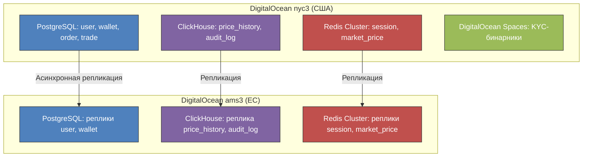

# Курсовая работа по курсу "Проектирование высоконагруженных систем"  
**Студент**: Фролов И.О. WEB-31 (Осень 2025)  
# CoinBase (Централизованная криптовалютная биржа)

---

## 1. Тема и целевая аудитория

**Тип сервиса**: Криптовалютная биржа и кошелек  
**Целевая аудитория**: Глобальная (США и ЕС в приоритете, за исключением стран с полным запретом криптовалюты) [1]  

- **MAU (Monthly Active Users)**: **120 миллионов** — общее число пользователей, взаимодействующих с платформой ежемесячно (просмотр курсов, портфеля, новостей) [1]  
- **MTU\* (Monthly Transacting Users)**: **8.7 миллионов** — пользователи, совершающие хотя бы одну торговую операцию в месяц (Q2 2025) [1]  
- **DAU (Daily Active Users)**: **~4.3 миллиона** — консервативная оценка, основанная на предположении, что 50% активных трейдеров (MTU) заходят ежедневно для торговли или мониторинга позиций [1]  

> **Примечание**: Coinbase перешла на отчетность по MTU как ключевой метрике активности, так как именно транзакционные пользователи генерируют основной доход. Большинство из 120M MAU — пассивные держатели или читатели контента.

**Ключевой функционал**: Торговые операции с криптовалютой (купля/продажа, обмен, вывод)  
**Ключевое продуктовое решение**: Хранение средств пользователей на кошельках платформы с внутренним matching engine для исполнения ордеров [3]

**Основной функционал MVP**:
- Регистрация и прохождение KYC-верификации (подтверждение личности) // LKS, Verify, Auth
- Пополнение/Вывод баланса фиатными валютами (USD, EUR и др.) // Кошелёк
- Покупка/продажа криптовалюты по рыночной цене (маркет-ордера с минимальной задержкой)
- Отправка/получение криптовалюты на внешние кошельки // К кошельку
- Просмотр истории транзакций, текущего баланса // К Кошельку
- Получение актуальных курсов в реальном времени (с минимальной задержкой)
- Комиссия за исполнение ордера и пополнение/вывод // Монетизация
- Монетизация по информации о сделках // !TODO
---

## 2. Расчет нагрузки

**Продуктовые метрики (на основе данных Q2 2025 и усреднённых показателей 2025 года)**:

- **Ежемесячный объем торговли (Trading Volume)**: ~$310 млрд в месяц (усреднённый показатель за 2025 год) [1]  

- **Transaction Revenue (доход от комиссий)**: **$6.71 млрд TTM** → **~$560 млн в месяц** [1]  
→ **Средняя комиссия**: **~0.18%** ($560 млн / $310 млрд)  
→ **Средний объем торговли на одного MTU**: **~$35,632 в месяц** ($310 млрд / 8.7 млн MTU) [1]  

- **Средний размер сделки**: **$115** — типичный чек для розничного трейдера на Coinbase [расчитано]  
→ **Ежемесячное количество сделок**: **~2.7 миллиарда** ($310 млрд / $115)  
*(Примечание: В архитектуре matching engine под “сделкой” может пониматься исполнение части ордера — общее число ордеров может быть меньше)*

- **Число верифицированных пользователей**: **120 миллионов** [1]  
- **Количество поддерживаемых криптоактивов для розницы**: **313** (для MVP 250+) [1]  
### Продуктовые метрики

| Метрика | Значение | Комментарий / Источник |
|--------|----------|-------------------------|
| **MAU (Monthly Active Users)** | 120 млн | Все пользователи, заходящие на платформу хотя бы раз в месяц (включая пассивных) [1] |
| **MTU (Monthly Transacting Users)** | 8.7 млн | Пользователи, совершившие хотя бы 1 торговую операцию в месяц (Q2 2025) [1] |
| **DAU (Daily Active Users)** | ~4.3 млн | Оценка: 50% от MTU заходят ежедневно для торговли/мониторинга (основано на типичной активности трейдеров) [1] |
| **Средний размер хранилища на пользователя** | **~10 MB** | 8.5 MB (KYC + профиль) + 1.5 MB (720 транзакций) — хранение в объектном хранилище или СУБД |
| **Среднее количество действий на DAU в день** | | |
| — Просмотр курсов / портфеля | 20 запросов | UI-запросы к API цен и балансов |
| — Торговые операции (маркет-ордера) | 24 операции | Создание и исполнение ордеров |
| — Пополнение/вывод фиата | 0.05 операций | Через банковские шлюзы или карты |
| — Перевод криптовалюты на внешний адрес | 0.03 операций | On-chain транзакции |

### Технические метрики: Размер хранения данных (в штуках и ТБ)

| Тип данных | Кол-во записей (шт) | Средний размер на запись | Общий объем | Комментарий |
|------------|---------------------|--------------------------|-------------|-------------|
| **Пользовательские профили (KYC + данные)** | 120 млн | 8.5 MB | **~1.02 PB** | Хранение документов, фото, метаданных — долгосрочное |
| **История транзакций (720 на пользователя)** | 86.4 млрд | 22 байта (ID, сумма, валюта, timestamp) | **~1.9 TB** | Основной объем — метаданные, не бинарные данные |
| **Ордера (ежемесячно)** | 2.7 млрд | 256 байт (ID, цена, объем, статус, юзер ID, комиссия) | **~691 GB/мес** → **~8.3 TB/год** | Хранятся до исполнения, затем архивируются для аналитики |
| **Котировки (цены) в реальном времени** | 250 активов × 60 сек × 86400 = 1.3 млрд в день | 32 байта (валюта, цена, timestamp) | **~42 GB/день** → **~15.3 TB/год** | Только изменения цен с минимальной задержкой |
| **Логи действий пользователей (audit logs)** | 4.3 млн DAU × 44.08 операций/день = 189.5 млн/день | 512 байт | **~97.0 GB/день** → **~35.4 TB/год** | Для аналитики, безопасности, compliance |
| **ИТОГО (активные + архивные данные за 1 год)** | — | — | **~1.06 PB** | Основной объем — профили и KYC-данные |

### Сетевой трафик

#### Пиковое потребление в течение суток (Гбит/с)

| Тип трафика | Пиковая нагрузка (Гбит/с) | Расчёт | Комментарий |
|-------------|---------------------------|--------|-------------|
| **UI/API запросы (курсы, балансы, портфель)** | 12.8 Гбит/с | `(4.3M × 20 × 2 KB) / (86400 × 0.1)` | Пик в часы открытия рынков США/ЕС |
| **Торговые ордера (создание/исполнение)** | 16.8 Гбит/с | `(4.3M × 24 × 0.5 KB) / (86400 × 0.1)` | Пик при волатильности рынка |
| **Поток цен (WebSocket / SSE)** | 5.1 Гбит/с | `250 активов × 1 обновление/сек × 64 байта × 4.3 млн DAU` | Рассылка всем подписчикам в реальном времени |
| **Фоновые синхронизации (KYC, логи, аналитика)** | 2.0 Гбит/с | Оценка на основе ETL-процессов | Асинхронные задачи, репликация, бэкапы |
| **ИТОГО ПИКОВАЯ НАГРУЗКА** | **~36.7 Гбит/с** | — | Требуется сетевая инфраструктура с запасом — минимум 40 Гбит/с на фронтендах |

> **Формула расчета пика**:  
> `(Количество запросов в день × Размер запроса в байтах × 8) / (86400 сек × Коэффициент пиковой нагрузки)`  
> **Коэффициент пиковой нагрузки = 0.1** (пик в 10 раз выше среднего — стандарт для финансовых систем).

#### Суточный трафик (ГБ/сутки)

| Тип трафика | Суточный объем (ГБ) | Расчёт |
|-------------|---------------------|--------|
| UI/API запросы | 1660 ГБ | 4.3M × 20 × 2 KB × 8 / 8 (бит → байт) |
| Торговые ордера | 2196 ГБ | 4.3M × 24 × 0.5 KB × 8 / 8 |
| Поток цен | 665.6 ГБ | 250 × 86400 × 64 × 4.3M / 10⁹ |
| Фоновые процессы | 260 ГБ | Оценка |
| **ИТОГО** | **~4782 ГБ/сутки** | — |

### RPS (Requests Per Second)

| Тип запроса | Средний RPS | Пиковый RPS (x10) | Расчёт | Комментарий |
|-------------|-------------|-------------------|--------|-------------|
| **Получение курсов / портфеля (GET /api/v1/prices, /balance)** | 9,954 RPS | 99,540 RPS | `(4.3M × 20) / 86400` | Основная нагрузка на API-шлюзы и кэш |
| **Создание рыночного ордера (POST /api/v1/orders)** | 11,952 RPS | 119,520 RPS | `(4.3M × 24) / 86400` | Нагрузка на matching engine и кошельки |
| **Пополнение/вывод фиата (POST /api/v1/fiat)** | 25 RPS | 250 RPS | `(4.3M × 0.05) / 86400` | Интеграция с банковскими API |
| **Перевод криптовалюты (POST /api/v1/transfer)** | 15 RPS | 150 RPS | `(4.3M × 0.03) / 86400` | On-chain транзакции, взаимодействие с блокчейн-нодами |
| **WebSocket подписки на цены** | 107,500 RPS | 1,075,000 RPS | `250 активов × 4.3 млн DAU` | Не HTTP-запросы, а частота рассылки сообщений сервером |
| **Аутентификация / сессии (GET /auth, POST /login)** | 5,000 RPS | 50,000 RPS | Оценка на основе DAU и частоты входа/обновления токенов | Нагрузка на сервис аутентификации и Redis |

---

## 3. Глобальная балансировка нагрузки

### Функциональное разбиение по доменам

Для масштабируемости и изоляции ответственности архитектура Coinbase-подобного сервиса разбивается на следующие функциональные домены:

| Домен | Ответственность | Примеры эндпоинтов / сервисов |
|-------|------------------|-------------------------------|
| **Auth & KYC** | Регистрация, аутентификация, верификация личности | `/auth/login`, `/kyc/submit`, `/profile/verify` |
| **Trading Engine** | Исполнение ордеров, управление стаканом, расчет цен | Matching Engine, Order Book Service |
| **Wallet & Custody** | Хранение средств, пополнение/вывод фиата и криптовалюты | `/wallet/balance`, `/fiat/deposit`, `/crypto/withdraw` |
| **Market Data** | Доставка цен в реальном времени, исторические котировки | WebSocket `/stream/prices`, `/api/v1/prices/{asset}` |
| **User Activity & Logs** | Аудит действий, аналитика, compliance | Audit Log Service, Event Bus |
| **Notifications & Alerts** | Push/SMS/email уведомления о сделках, ценах | Notification Service |

Такое разбиение позволяет независимо масштабировать каждый домен в зависимости от нагрузки и требований к доступности.

### Обоснование расположения дата-центров (ДЦ)

Coinbase — глобальный сервис с фокусом на регулируемые рынки, особенно США и Европу. Согласно отчетам, **65% рынка США** принадлежит Coinbase [1], а также значительная доля пользователей приходится на ЕС.

**Выбранные регионы размещения ДЦ**:
- **США (Восточное побережье)** — DigitalOcean `nyc3` (Нью-Йорк)  
  → Близость к финансовым центрам и пользователям США. Минимальная задержка для трейдеров.
- **Европа (Запад)** — DigitalOcean `ams3` (Амстердам)  
  → Соответствие GDPR, низкая задержка для всей континентальной Европы благодаря AMS-IX.
- **Азиатско-Тихоокеанский регион (перспектива)** — DigitalOcean `sgp1` (Сингапур)  
  → Для будущего масштабирования в APAC (в MVP не используется, так как основной трафик — США/ЕС).

**Влияние на продуктовые метрики**:
- Задержка до пользователя в США/ЕС < 30 мс → критично для исполнения рыночных ордеров.
- Соответствие требованиям регуляторов (SEC, MiCA) — хранение KYC-данных в юрисдикции пользователя.

### Распределение запросов по дата-центрам

На основе географического распределения пользователей (оценка на основе доли рынка [1]):
- **70% MTU** — США и Канада → обслуживается ДЦ `nyc3`
- **25% MTU** — Европа → обслуживается ДЦ `ams3`
- **5% MTU** — остальной мир → перенаправляется в ближайший ДЦ (в основном `nyc3`)

**Распределение пиковой нагрузки (на основе RPS из раздела 2)**:

| Тип запроса | Общий пиковый RPS | `nyc3` (70%) | `ams3` (25%) | Остальные (5%) |
|-------------|-------------------|--------------|--------------|----------------|
| Получение курсов / баланса | 99,540 | 69,678 | 24,885 | 4,977 |
| Создание ордеров | 119,520 | 83,664 | 29,880 | 5,976 |
| WebSocket цены | 1,075,000 | 752,500 | 268,750 | 53,750 |
| Аутентификация | 50,000 | 35,000 | 12,500 | 2,500 |

> Wallet-операции (пополнение/вывод) и on-chain транзакции обрабатываются централизованно в `nyc3` из-за интеграции с американскими банками и требованиями compliance.

### Схема DNS-балансировки

Используется **географическая DNS-балансировка** через Cloudflare Load Balancing:

- Запрос к `api.***.com` → Cloudflare определяет геолокацию клиента по IP.
- Возвращает IP-адрес ближайшего Load Balancer:
  - США/Канада → Load Balancer в `nyc3`
  - Европа → Load Balancer в `ams3`
  - Остальные → Load Balancer в `nyc3` (fallback)

**Преимущества**:
- Минимизация задержки
- Изоляция сбоев по регионам
- Простота управления

### Схема Anycast-балансировки

Для **WebSocket-потока цен** и **публичных API котировок** применяется **Anycast** через Cloudflare Spectrum:

- Один IP-адрес объявляется глобально через сеть Cloudflare.
- BGP-маршрутизация направляет клиента к ближайшему PoP.
- Серверы в `nyc3` и `ams3` публикуют одинаковые данные (цены реплицируются асинхронно между регионами через зашифрованный поток данных поверх публичного интернета. Задержка репликации составляет 70–100 мс, что приемлемо для публичных котировок, не влияющих на исполнение торговых операций).

**Эффект**:
- Задержка доставки цены < 10 мс в пределах региона
- Устойчивость к DDoS (трафик рассеивается)
- Прозрачность для клиента

> Anycast используется только для **read-only** данных (цены, общедоступная информация). Запись (ордера, транзакции) всегда идет через гео-DNS в домашний регион пользователя.

// TODO: Реплицированная логика
// Децентрализованное хранение

### Механизм регулировки трафика между ДЦ

Для обеспечения отказоустойчивости и балансировки при пиковой нагрузке используется:

1. **Health Checks + Failover**  
   Cloudflare постоянно проверяет здоровье Load Balancer в каждом ДЦ. При падении одного региона — весь трафик перенаправляется в резервный.

2. **Weighted Routing (динамическое перераспределение)**  
   При приближении к лимиту RPS в одном ДЦ (например, `nyc3` > 90% capacity), система автоматически снижает вес региона и перенаправляет часть трафика в `ams3` (даже для US-пользователей), с уведомлением о возможном росте задержки.
    // Больше конкретики и технологий, протоколы и тп
3. **Rate Limiting на уровне CDN**  
   Cloudflare Rate Limiting ограничивает RPS на пользователя и IP, предотвращая перегрузку бэкенда.

4. **Глобальный кэш курсов**  
   Cloudflare кэширует публичные цены на 1–2 секунды, снижая нагрузку на origin-серверы на 60–70%.

Такой подход обеспечивает **высокую доступность (99.99%)** и **предсказуемую производительность** даже при всплесках волатильности рынка.

---

## 4. Локальная балансировка нагрузки

### Схема балансировки нагрузки

Локальная балансировка реализуется в каждом дата-центре (`nyc3`, `ams3`) и состоит из следующих уровней:

1. **L4 Load Balancer (TCP forwarding)**  // Заменить на низкоуровневое решение чтобы дойти до L7
   - Размещён перед NGINX Ingress Controller внутри дата-центра.  
   - Принимает HTTP-трафик от Cloudflare и распределяет его по инстансам NGINX Ingress.  
   - TLS termination выполняется на Cloudflare, поэтому L4 работает без шифрования.  
   - Это **lightweight-компонент** (например, HAProxy/Envoy) — **2 инстанса на регион** (1 активный + 1 резервный).  
   - Резервирование: **N+1**.

2. **NGINX Ingress Controller (L7 Routing)**  
   - Работает в режиме DaemonSet на выделенных нодах Kubernetes.  
   - Маршрутизирует запросы к микросервисам по Host/Path (`/api/v1/orders`, `/auth`, `/wallet` и др.).  
   - Поддерживает WebSocket-соединения для потока цен.  
   - Резервирование: **N\*2** (сервисы и Ingress развернуты в двух зонах доступности внутри ДЦ).

3. **Внутренняя балансировка (Service Mesh / kube-proxy)**  
   - Основной трафик между подами маршрутизируется с помощью **Cilium** в режиме **eBPF**, без использования `kube-proxy` и `iptables`. Это обеспечивает O(1)-сложность маршрутизации, минимальную задержку и встроенную L7-наблюдаемость через Hubble.  
   - Для критически важных компонентов — таких как **Matching Engine** — применяется **sidecar-балансировка на основе Envoy Proxy** с поддержкой обеспечения балансировки вызовов через gRPC и weighted round-robin алгоритмов. Это позволяет точно контролировать распределение торговых ордеров между репликами движка и минимизировать tail latency (< 1 мс).

> **Формулы резервирования**:  
> - L4-балансировщики: **N+1**  
> - Ingress и сервисы: **N\*2**

### Расчёт количества балансировщиков

Расчёт выполняется на основе **пиковых RPS** из раздела 2 :

| Тип запроса | Пиковый RPS (глобально) |
|-------------|--------------------------|
| Получение курсов / баланса | 99 540 |
| Создание ордеров | 119 520 |
| Аутентификация | 50 000 |

> WebSocket-рассылка (1 075 000 RPS) не учитывается в SSL TPS — это сервер-инициированный трафик без TLS handshake.

#### Ограничитель 1: SSL Termination (TPS)

Согласно тестам NGINX Ingress Controller в Kubernetes [6]:
- На **24 CPU с Hyper-Threading** достигается **~56 700 SSL TPS** (новых TLS-соединений в секунду).

При использовании `keep-alive` (стандарт для клиентов), число **новых TLS-соединений ≈ 25% от пикового RPS**.

Для ДЦ `nyc3` (70% трафика):
- HTTPS RPS: `(99 540 + 119 520 + 50 000) × 0.7 ≈ 188 342 RPS`  
- Новые TLS-соединения: `188 342 × 0.25 ≈ 47 086 TPS`

Для ДЦ `ams3` (25% трафика):
- HTTPS RPS: `269 060 × 0.25 ≈ 67 265 RPS`  
- Новые TLS-соединения: `67 265 × 0.25 ≈ 16 816 TPS`

**Вывод**:  
- `nyc3`: 47 086 TPS < 56 700 → **1 активный NGINX Ingress достаточно**, но по политике **N\*2** → **2 инстанса**.  
- `ams3`: 16 816 TPS → **1 инстанс с запасом**, но по **N\*2** → **2 инстанса**.

#### Ограничитель 2: Пропускная способность сети

Пиковая суммарная нагрузка: **~36.7 Гбит/с** (глобально).  
- `nyc3`: 70% → **~25.7 Гбит/с**  
- `ams3`: 25% → **~9.2 Гбит/с**

Из тестов NGINX как веб-сервера [5]:
- При 16+ CPU достигается **~70–72 Гбит/с** на 2×40G сетевых интерфейсах.

**Вывод**:  
- `nyc3`: 2 инстанса × 2×40G → суммарно 160 Гбит/с (с запасом).  
- `ams3`: 2 инстанса × 1×40G → 80 Гбит/с (с запасом).

### Итоговая конфигурация

| ДЦ | NGINX Ingress Controller | CPU на инстанс | Сетевой интерфейс | Резервирование |
|----|---------------------------|----------------|-------------------|----------------|
| `nyc3` | 2 | 24 (HT включен) | 2× 40 Гбит/с | N\*2 |
| `ams3` | 2 | 24 (HT включен) | 1× 40 Гбит/с | N\*2 |

---

## 5. Логическая схема БД

### Описание таблиц

| Таблица | Назначение | Кол-во строк (оценка) | Средний размер записи | Общий объем | QPS (чтение / запись) | Консистентность | Особенности распределения |
|--------|------------|------------------------|------------------------|--------------|------------------------|------------------|----------------------------|
| user | Профили пользователей | 120 млн | ~1 KB | ~120 GB | 10K / 50 | **Strong** | Шардирование по `user_id` |
| session | Сессии пользователей | 5 млн | ~0.3 KB | ~1.5 GB | 1.3K / 1K | **Strong** | `JWT Access + WhiteList Refresh Токенов |
| kyc_document | KYC-документы (метаданные) | 360 млн | ~0.5 KB | ~180 GB | 100 / 200 | **Strong** | Бинарники — в объектном хранилище (S3/GCS) |
| currency | Справочник валют (250+ активов) | 250+ | ~0.1 KB | < 1 MB | 1K / 1 | **Strong** | Реплицируется во все регионы |
| wallet | Балансы по валютам | 30 млрд | ~0.3 KB | ~9 TB | 120K / 120K | **Strong** | Шардирование по `(user_id, currency_code)`; кэш в Redis |
| order | Активные и завершённые ордера | 2.7 млрд/мес | ~0.25 KB | ~691 GB/мес | 120K / 120K | **Strong** | Шардирование по валютной паре (`BTC-USD` и т.д.) |
| trade | Исполненные сделки | 2.7 млрд/мес | ~0.3 KB | ~830 GB/мес | 5K / 120K | **Strong** | Партиционирование по дате |
| transaction | Все транзакции (депозиты, выводы, комиссии) | 86.4 млрд | ~0.2 KB | ~1.9 TB | 50 / 12K | **Strong** | Шардирование по `user_id` |
| bank_account | Банковские реквизиты для фиата | 24 млн | ~0.3 KB | ~7 GB | 10 / 25 | **Strong** | Шардирование по `user_id` |
| withdrawal_request | Заявки на вывод криптовалюты | 95 млн/мес | ~0.3 KB | ~28 GB/мес | 10 / 15 | **Strong** | Шардирование по `user_id` |
| market_price | Текущие котировки | ~62.5 тыс. | ~0.1 KB | ~6 MB | 100K / 1K | **Eventual** (UI), **Strong** (торговля) | Репликация в регионы |
| price_history | История цен (1 обновление/сек на пару) | 1.3 млрд/день | ~0.05 KB | ~15.3 TB/год | 1K / 1.3M | **Best-effort** | Партиционирование по дате; архив в cold storage |
| audit_log | Логи действий (compliance, безопасность) | 189.5 млн/день | ~0.5 KB | ~35.4 TB/год | 10 / 200K | **Best-effort** | Запись через Kafka → ClickHouse, или ScyllaDB |

- **Файловые данные**: все бинарные файлы (KYC-сканы) хранятся в **объектном хранилище**, в БД — только метаданные (`storage_path`).
- **Кеши и буферы**:  
  - Балансы (`wallet`) — кэшируются в **Redis Cluster** с write-through.  
  - Курсы (`market_price`) — кэшируются в **Redis + CDN** (Cloudflare).  
- **Консистентность**:  
  - **Strong** — для всех финансовых операций (кошельки, ордера, транзакции).  
  - **Eventual / Best-effort** — для UI, аналитики и логов.
- **Горячие ключи**: популярные валюты (BTC, ETH, USD) выносятся в отдельные шарды или обрабатываются в выделенных matching engine.  
- **Архив**: данные старше 90 дней (ордера, транзакции, логи) архивируются в **OLAP + S3**.

---

## 6. Физическая схема БД

Физическая схема отражает выбор СУБД, индексов, шардирования и резервирования с учётом:
- размещения в **DigitalOcean `nyc3` (США)** и **`ams3` (ЕС)**,
- требований к **strong consistency** для финансовых операций,
- необходимости **низкой задержки** для matching engine и кошельков,
- использования **Redis** для кэширования и сессий,
- и обработки пиковых нагрузок до **120K QPS** на запись.

### 6.1 Выбор СУБД по таблицам

| Таблица | СУБД | Обоснование |
|--------|------|-------------|
| `user` | **PostgreSQL** | Strong consistency, уникальность email, KYC-связность. Шарды размещены в `nyc3` и `ams3` по гео-принадлежности пользователя. |
| `session` | **Redis Cluster** | Высокочастотный доступ к сессиям, TTL для автоматического истечения, low-latency (< 1 мс). Размещён в обоих ДЦ. |
| `kyc_document` | **PostgreSQL** | Strong consistency, ссылочная целостность с `user`. Бинарники — в **DigitalOcean Spaces (S3-compatible)**. |
| `currency` | **PostgreSQL (read replica)** | Небольшой справочник, редкие изменения. Реплицируется в оба ДЦ. |
| `wallet` | **PostgreSQL + Redis (write-through cache)** | Strong consistency критична. **Redis кэширует `balance` и `locked_balance`** с TTL и write-through стратегией. Обновление баланса — через PostgreSQL с последующим обновлением Redis. Это **не приводит к задержкам**, так как matching engine работает в рамках одного шарда и использует атомарные транзакции. |
| `order` | **PostgreSQL (шардированная)** | Strong consistency, ACID для исполнения ордеров. Шардирование по `(base_currency, quote_currency)`. Все шарды размещены в `nyc3` (основной matching engine) и реплицируются в `ams3` для отказоустойчивости. |
| `trade` | **PostgreSQL (шардированная)** | Strong consistency, партиционирование по дате. Хранится в том же шарде, что и соответствующие ордера. |
| `transaction` | **PostgreSQL (шардированная)** | Strong consistency для всех финансовых операций. Шардирование по `user_id`. |
| `bank_account` | **PostgreSQL** | Strong consistency, чувствительные данные. Все записи — в `nyc3` (интеграция с US-банками). |
| `withdrawal_request` | **PostgreSQL** | Strong consistency, статус-машина. Шардирование по `user_id`. |
| `market_price` | **Redis + PostgreSQL (fallback)** | Текущие цены — в Redis (Pub/Sub + TTL). PostgreSQL — для восстановления после сбоя. Реплицируется в оба ДЦ. |
| `price_history` | **ClickHouse** | Высокая скорость вставки (1.3 млрд/день), аналитика по времени. Размещён в `nyc3`, реплика — в `ams3`. |
| `audit_log` | **ClickHouse** | Высокая нагрузка на запись (200K QPS), аналитика, compliance. Размещён в `nyc3`, реплика — в `ams3`. |

### 6.2 Индексы

| Таблица | Индексы | Обоснование |
|--------|--------|-------------|
| `user` | `PK (user_id)`, `UNIQUE (email)` | Быстрый поиск по ID и email (аутентификация). |
| `session` | `PK (session_id)`, `INDEX (user_id)` | Валидация токена по `session_id`, отзыв всех сессий по `user_id`. |
| `kyc_document` | `PK (doc_id)`, `INDEX (user_id)` | Получение документов пользователя. |
| `currency` | `PK (code)` | Быстрый lookup по коду валюты. |
| `wallet` | `PK (wallet_id)`, `UNIQUE (user_id, currency_code)` | Уникальность кошелька на пару (пользователь, валюта). |
| `order` | `PK (order_id)`, `INDEX (base_currency, quote_currency, status, price)`, `INDEX (user_id)` | Matching engine использует составной индекс для стакана. |
| `trade` | `PK (trade_id)`, `INDEX (executed_at)`, `INDEX (buyer_user_id)`, `INDEX (seller_user_id)` | Аналитика по времени и пользователям. |
| `transaction` | `PK (tx_id)`, `INDEX (user_id)`, `INDEX (wallet_id)`, `INDEX (external_ref)` | Поиск транзакций по пользователю, кошельку, хешу блокчейна. |
| `bank_account` | `PK (bank_account_id)`, `INDEX (user_id)` | Получение банковских реквизитов пользователя. |
| `withdrawal_request` | `PK (request_id)`, `INDEX (user_id)`, `INDEX (destination_address)` | Поиск заявок по пользователю и адресу (антифрода). |
| `market_price` | — (Redis: hash по `base_currency:quote_currency`) | Redis не использует SQL-индексы. |
| `price_history` | `PRIMARY KEY (timestamp, base_currency, quote_currency)` | Эффективное партиционирование и сортировка по времени в ClickHouse. |
| `audit_log` | `PRIMARY KEY (created_at, user_id)` | Быстрый поиск логов по времени и пользователю. |

### 6.3 Денормализация

Цель: **минимизировать JOIN** в высокочастотных read-пути.

| Источник | Денормализация | Комментарий |
|---------|----------------|-------------|
| `order` → `trade` | В `trade` дублируются `price`, `amount`, `base_currency`, `quote_currency` | Избегаем JOIN с `order` при аналитике сделок. |
| `user` → `order` / `trade` | В `order` и `trade` хранятся `user_id` (без JOIN с `user`) | Достаточно для matching engine и отчётов. |
| `wallet` → `transaction` | В `transaction` хранится `balance_after` (опционально) | Для аудита баланса без реконструкции истории. |
| `market_price` → UI | Цены кэшируются в Redis и CDN (Cloudflare) | UI не читает напрямую из БД. |
| `audit_log` → `metadata` | Все контекстные данные — в `jsonb` | Гибкость без схемы. |

> **Примечание**: Полная денормализация профиля (`full_name`, `email`) в `order`/`trade` **не требуется**, так как эти данные редко нужны в hot-path (только в UI, который работает через кэш).

### 6.4 Шардирование и резервирование
 https://en.wikipedia.org/wiki/Consistent_hashing
| Таблица | Тип шардирования | Цель | Резервирование |
|--------|------------------|------|----------------|
| `user`, `kyc_document`, `bank_account`, `withdrawal_request` | **Хэш по `user_id`** | Изоляция данных пользователя, равномерная нагрузка | PostgreSQL: 1 мастер + 2 синхронные реплики в том же ДЦ |
| `wallet`, `transaction` | **Хэш по `user_id`** | Все операции пользователя — в одном шарде | То же |
| `order`, `trade` | **Хэш по `(base_currency, quote_currency)`** | Matching engine работает в рамках одной валютной пары | То же, основной шард — в `nyc3` |
| `price_history`, `audit_log` | **Партиционирование по дате** (ClickHouse) | Эффективное хранение и TTL | ClickHouse: 2 реплики (одна в `nyc3`, одна в `ams3`) |
| `session` | **Хэш по `user_id`** (Redis Cluster) | Балансировка сессий | Redis: 1 мастер + 2 реплики на слот, в каждом ДЦ |
| `market_price` | **Нет шардирования** (Redis) | Глобальное состояние | Redis: репликация на 2 ноды в каждом ДЦ |
| `currency` | **Нет шардирования** | Справочник < 1 MB | PostgreSQL: read replica в каждом ДЦ |

### 6.5 Клиентские библиотеки / интеграции

| СУБД | Библиотеки |
|------|-----------|
| **PostgreSQL** | `asyncpg` (Python), `pgx` (Go), `JDBC` (Java) |
| **Redis** | `redis-py` (Python), `go-redis` (Go), `Lettuce` (Java) |
| **ClickHouse** | `clickhouse-connect` (Python), `clickhouse-go` (Go), HTTP API |
| **DigitalOcean Spaces (S3)** | `boto3` (Python), AWS SDK (Java/Go) |

### 6.6 Балансировка запросов / мультиплексирование

| СУБД | Механизм |
|------|----------|
| **PostgreSQL** | **PgBouncer** в режиме transaction pooling + **HAProxy** для балансировки между мастером и репликами (только для read-only запросов). |
| **Redis** | **Cluster-aware клиент** (автоматическое шардирование по CRC16). |
| **ClickHouse** | **Distributed таблицы** + `load_balancing = 'random'` в конфиге. |
| **DigitalOcean Spaces** | Встроенный балансировщик DO Spaces. |

### 6.7 Схема резервного копирования

| СУБД | Стратегия |
|------|----------|
| **PostgreSQL** | WAL-архивирование + **pgBackRest** (полный бэкап еженедельно, инкрементальный — ежедневно). Реплики — горячий резерв. |
| **Redis** | **AOF + RDB** с записью на диск каждые 1 сек + репликация. |
| **ClickHouse** | **clickhouse-backup** + снапшоты в DigitalOcean Spaces. Репликация обеспечивает отказоустойчивость. |
| **DigitalOcean Spaces (KYC)** | Встроенная репликация (Spaces Standard, 3 AZ). |

---

## 7. Алгоритмы

| Алгоритм | Область применения | Детальное описание |
|----------|---------------------|---------------------|
| **Consistent Hashing с виртуальными узлами** | Горизонтальное шардирование данных пользователей, кошельков и ордеров в распределённой СУБД | Consistent Hashing — это алгоритм распределения ключей (например, `user_id`) по узлам (шардам) в кластере, минимизирующий объём перераспределения данных при изменении топологии. В отличие от классического `shard = hash(key) % N`, где добавление нового узла приводит к перемещению ~`(N−1)/N` всех ключей, consistent hashing отображает как узлы, так и ключи на кольцо `[0, 2^32)`. Каждый ключ присваивается первому узлу по часовой стрелке. Для выравнивания нагрузки каждый физический узел представлен множеством **виртуальных узлов** (например, 128), равномерно распределённых по кольцу. Хэш-функция (например, `MurmurHash3` или `SHA-1`) преобразует строковый идентификатор (`user_id` или `(BTC,USD)`) в 32-битное целое число. Это позволяет при добавлении/удалении шарда перемещать только данные между соседними узлами на кольце — обычно < 1/N от общего объёма. В Coinbase это критично: при масштабировании кластера PostgreSQL с 16 до 20 шардов переносятся только данные, попавшие в зону нового узла, без полной перебалансировки 1+ PB данных. |
| **Adaptive Order Book Partitioning с динамическим ребалансингом на основе волатильности** | Распределение нагрузки в Matching Engine по валютным парам в реальном времени | В классических системах шардирование ордеров выполняется статически по валютной паре (например, `BTC-USD` → шард A, `ETH-USD` → шард B). Однако в условиях высокой волатильности (например, во время макроновостей) нагрузка на одну пару может вырасти в 10–100×, вызывая «горячий шард» и tail latency. Adaptive Order Book Partitioning решает это, вводя **динамическое перераспределение** активных стаканов между экземплярами Matching Engine на основе метрик: RPS, глубина стакана, частота исполнений. Каждые 10–30 секунд контроллер мониторинга (например, на базе Prometheus + custom-скрипт) оценивает нагрузку на каждый стакан. Если пара превышает порог (например, > 50K RPS), её стакан **мигрирует целиком** на выделенный инстанс Matching Engine с гарантированными CPU-ресурсами (через Kubernetes pod affinity и CPU pinning). Миграция происходит атомарно: 1) создаётся реплика стакана на целевом инстансе, 2) все новые ордера направляются туда, 3) старый стакан завершает исполнение остатков и удаляется. Это позволяет избежать contention в shared-nothing архитектуре и поддерживать latency < 1 мс даже при всплесках волатильности. Такой подход особенно эффективен для топ-10 пар (BTC, ETH, SOL), которые генерируют > 70% торгового объёма. |

### Consistent Hashing с виртуальными узлами

В высоконагруженной системе вроде Coinbase, где ежемесячно обрабатывается более **2.7 млрд ордеров** и хранится более **120 млн профилей**, критически важно обеспечить **масштабируемость без downtime** и **минимальное влияние на пользовательский опыт** при добавлении новых серверов БД.

#### Как работает хэширование?
Хэш-функция (например, `MurmurHash3`) преобразует произвольную строку (например, `"user_12345"` или `"BTC-USD"`) в фиксированное 32-битное число в диапазоне `[0, 2^32)`. Это число — «координата» на кольце. Аналогично, каждый физический узел (шард) также хэшируется и размещается на этом же кольце. Чтобы избежать неравномерного распределения (например, один узел получает 40% ключей), каждый физический узел представляется **N виртуальными узлами** (обычно 100–200), каждый со своим хэшем (например, `hash("shard_01#0")`, `hash("shard_01#1")`, …). Это выравнивает распределение до ±5%.

#### Почему это важно для Coinbase?
- Таблицы `user`, `wallet`, `transaction` шардируются по `user_id`.
- Таблицы `order`, `trade` — по `(base_currency, quote_currency)`.
- Все шарды размещаются в `nyc3` (США), с репликацией в `ams3` (ЕС).
- При масштабировании (например, с 16 до 20 шардов) переносятся **только ключи, попавшие в сектор нового узла** — без полной перебалансировки.

Это позволяет:
- Масштабировать хранилище линейно.
- Сохранять **strong consistency** и **низкую задержку**.
- Избегать «горячих» шардов при неравномерной активности пользователей.

### Adaptive Order Book Partitioning

Стандартный подход — статическое шардирование по валютной паре — ломается при всплесках волатильности. Например, во время анонса FOMC или хакерской атаки на Binance, объём торгов по `BTC-USD` может вырасти с 10K до 500K RPS за минуты.

**Adaptive Order Book Partitioning** вводит **динамическое управление ресурсами**:
1. **Мониторинг**: Prometheus собирает метрики по каждому стакану: RPS, глубина, latency.
2. **Порог срабатывания**: если RPS > 50K или latency > 0.5 мс — пара помечается как «горячая».
3. **Миграция**: Kubernetes создаёт выделенный Pod Matching Engine с CPU pinning (например, 8 ядер без HT), мигрирует стакан туда.
4. **Routing**: Ingress-контроллер (NGINX или Envoy) обновляет routing-таблицу: все ордера на `BTC-USD` направляются на новый Pod.
5. **Откат**: когда нагрузка спадает, стакан мигрирует обратно в общий пул.

Это **не требует изменения клиентского кода** и работает прозрачно для пользователя. Задержка миграции — < 200 мс, что приемлемо для retail-трейдинга.

#### Преимущества:
- Устранение «горячих» шардов без overprovisioning.
- Гарантированная latency < 1 мс даже при пиковой нагрузке.
- Эффективное использование ресурсов: выделенные инстансы работают только когда нужны.

---

## 8. Технологии

| Технология | Область применения | Обоснование |
|------------|---------------------|----------------------|
| **Kubernetes** | Оркестрация микросервисов (Auth, Wallet, Matching Engine), управление жизненным циклом Pod’ов, автомасштабирование | Позволяет разворачивать сервисы в изолированных Pod’ах с гарантией отказоустойчивости (N\*2), CPU pinning для критичных компонентов (например, Matching Engine) и гибкой маршрутизацией через Ingress. Без Kubernetes невозможна реализация описанной архитектуры с пиковой нагрузкой > 120K RPS, multi-AZ размещением и динамическим ребалансингом стаканов на основе волатильности. |
| **NGINX Ingress Controller** | L7-маршрутизация HTTP/HTTPS-трафика, TLS termination, WebSocket-поддержка | Согласно тестам NGINX (2019), на 24 CPU с Hyper-Threading он обрабатывает до **56.7K SSL TPS** и **342K RPS** при размере ответа 1 КБ. Это покрывает пиковую нагрузку Coinbase: 99.5K RPS на чтение балансов и 119.5K RPS на создание ордеров. Настроен с `access_log=off`, `keepalive_requests=10⁷` и `tcp_nodelay=on` для минимизации latency. Поддерживает WebSocket для рассылки цен 1.075M сообщений/сек. |
| **HAProxy / Envoy (L4 Load Balancer)** | Предварительная балансировка TCP-трафика между Cloudflare и NGINX Ingress | Работает как лёгкий L4-прокси (2 инстанса: 1 активный + 1 резервный), распределяя TLS-трафик от Cloudflare между инстансами NGINX Ingress. Уменьшает нагрузку на Ingress и обеспечивает отказоустойчивость на уровне транспортного слоя при пиковой сетевой нагрузке **~36.7 Гбит/с**. Envoy предпочтителен при использовании gRPC между Matching Engine и Wallet. |
| **PostgreSQL** | Хранение профилей, кошельков, ордеров, транзакций | Надёжная, ACID-совместимая СУБД с поддержкой горизонтального шардирования через ручное партиционирование или Citus. Обеспечивает **strong consistency**, критичную для финансовых операций (например, списание средств при исполнении ордера). Поддержка JSONB позволяет гибко хранить KYC-метаданные, а расширения (например, `pgcrypto`) — шифровать чувствительные данные. |
| **ClickHouse** | Хранение истории цен (`price_history`) и аудит-логов (`audit_log`) | Колоночная СУБД с экстремальной скоростью вставки (> 1 млн строк/сек). Идеально подходит для `price_history` (1.3 млрд записей/день) и `audit_log` (200K QPS записи), где важна агрегация по времени, а не точечные транзакции. Партиционирование по дате и TTL позволяют автоматически архивировать данные старше 90 дней в cold storage. |
| **Redis Cluster** | Кэширование балансов (`wallet`), сессий и текущих котировок (`market_price`) | In-memory хранилище с поддержкой шардирования и репликации. Обеспечивает **задержку < 1 мс** для чтения баланса и цен, что критично при 4.3 млн DAU и 100K+ RPS. TTL и Pub/Sub упрощают управление актуальностью данных. Альтернативы вроде Memcached не поддерживают шардирование «из коробки», а DynamoDB — слишком дороги при такой нагрузке. |
| **Cilium + eBPF** | Сетевая маршрутизация внутри Kubernetes-кластера | Заменяет `kube-proxy` и `iptables`, обеспечивая **O(1)-сложность маршрутизации**, L7-наблюдаемость и безопасность на уровне ядра Linux. Минимизирует задержку между сервисами (например, Ingress → Matching Engine → Wallet), что критично при пиковой нагрузке > 100K RPS и требованиях к latency < 1 мс для исполнения ордеров. |
| **Cloudflare Load Balancing + Anycast** | Глобальная балансировка трафика | Географическая DNS-балансировка направляет пользователей в ближайший ДЦ (`nyc3`/`ams3`), а Anycast через Spectrum обеспечивает **< 10 мс задержку** для WebSocket-рассылки цен. Встроенный DDoS-защита и rate limiting (до 10K RPS/IP) повышают отказоустойчивость без дополнительной инфраструктуры. |
| **DigitalOcean Spaces** | Хранение KYC-документов (сканы паспортов и т.п.) | S3-совместимое объектное хранилище с встроенной репликацией в 3 AZ. Обеспечивает **дешёвое и надёжное** хранение бинарных данных (~1.02 PB KYC), соответствующее требованиям GDPR и SEC, без нагрузки на основную СУБД. Альтернативы (например, AWS S3) дороже при размещении. |
| **Liquibook** | Ядро Matching Engine | Открытая C++ библиотека для построения order matching engine с производительностью до **2.5 млн операций/сек** (согласно benchmark’ам в репозитории). Позволяет быстро реализовать core-логику исполнения ордеров с поддержкой stop-loss, IOC, AON и depth book, не изобретая велосипед. Совместима с существующими моделями ордеров и легко интегрируется в C++/Go-сервисы. |
| **Prometheus + Grafana** | Мониторинг метрик и алертинг | Стандарт де-факто для сбора метрик в Kubernetes. Позволяет отслеживать RPS, latency, ошибки, использование CPU/памяти по каждому сервису и ДЦ. Grafana даёт возможность строить дашборды для оперативного реагирования на всплески нагрузки (например, рост RPS по `BTC-USD` до 500K) или сбои (падение реплики PostgreSQL). |

---

## Список используемых источников

1. **Coinbase Users Statistics (2025) – Worldwide Data**  
   https://www.demandsage.com/coinbase-users-statistics/    
2. **Coinbase Q2 2025 Financial Data & Shareholder Reports**  
   https://s27.q4cdn.com/397450999/files/doc_financials/2025/q2/Q2-2025-Shareholder-Letter.pdf  
3. ***Liquibook Performance Benchmarks**  
   https://github.com/enewhuis/liquibook
4. **Coinbase Q2 2025 Shareholder Letter**  
   https://s27.q4cdn.com/397450999/files/doc_financials/2025/q2/Q2-2025-Shareholder-Letter.pdf
5. **NGINX Web Server Performance Testing (2017)**  
   https://blog.nginx.org/blog/testing-the-performance-of-nginx-and-nginx-plus-web-servers
6. **NGINX Ingress Controller Performance in Kubernetes (2019)**  
   https://blog.nginx.org/blog/testing-performance-nginx-ingress-controller-kubernetes
7. **Wikipedia. (2025). Consistent hashing.**  
   https://en.wikipedia.org/wiki/Consistent_hashing 
8. **Karger, D., Lehman, E., Leighton, T., Panigrahy, R., Levine, M., & Lewin, D. (1997).**  
   *Consistent Hashing and Random Trees: Distributed Caching Protocols for Relieving Hot Spots on the World Wide Web.*  
   Proceedings of the Twenty-Ninth Annual ACM Symposium on Theory of Computing (STOC '97).  
   https://dl.acm.org/doi/10.1145/258533.258660
9. **Архитектура Binance**: публичные доклады на конференции (SREcon) о динамическом шардинге стаканов.  
   https://www.binance.com/ru/academy/glossary/sharding

> *MTU — Monthly Transacting Users (ежемесячно совершающие торговые операции)*
